# Isle of Rising Sun
> *"Conquer the lethal trials of the Rising Sun where every reflex is tested and every failure is a lesson to learn from."*

 

	<a href="https://uob-comsm0166.github.io/2026-group-22/">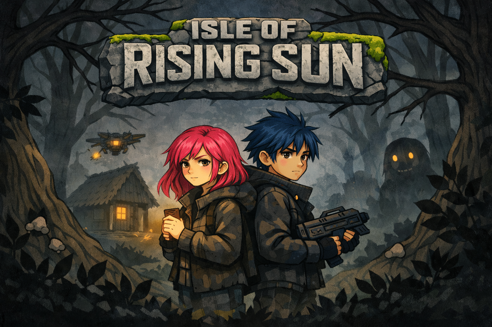</a>
	 
	<a href="https://uob-comsm0166.github.io/2026-group-22/">CLICK HERE to play Isle of Rising Sun</a>

## Game Demo
## Table of Contents

- [1. Development Team](#1-development-team)
- [2. Introduction](#2-introduction)
- [3. Requirements](#3-requirements)
- [4. Design](#4-design)
- [5. Implementation](#5-implementation)
- [6. Evaluation](#6-evaluation)
- [7. Process](#7-process)
- [8. Sustainability, Ethics, and Accessibility](#8-sustainability-ethics-and-accessibility)
- [9. Conclusion](#9-conclusion)
- [10. AI Statement](#10-ai-statement)
- [11. Contribution Statement](#11-contribution-statement)

## 1. Development Team

| Name | Email | Github | Role |
| -- | -- | -- | -- |
| Jiahao Zhao | uw25968@bristol.ac.uk | @zhaojiahao296 | role |
| Shalakorn Teerasukaporn | eu25930@bristol.ac.uk | @markslk | role |
| Mingyu Yang | ak25461@bristol.ac.uk | @mingyuyang0804 | role |
| Qing Shi | rp25678@bristol.ac.uk | @qqq033370 | role |
| Xinyi Zhang | ya25475@bristol.ac.uk | @nikanotaku | role |

## 2. Introduction

Isle of Rising Sun is a platform jumping game where players navigate through four levels of increasing difficulty to successfully complete the challenge. Its main inspiration comes from <b>Kirby & the Amazing Mirror</b> and <b>CupHead</b>. The core of the game is that within each level, players can control their characters to cross various platforms, collaborate with special allies to overcome obstacles, use different weapons to defeat various unique monsters, and use the coins collected along the way to purchase other weapons. After making a final decision on our baseline games, we came up with the ideas for our game mechanics and game twists which are as follows.

### 2.1 Game Mechanics and Twists

Our game consists of four levels where after each level the player has to complete the level ending boss fight. Each level will have different themes, diffrent environment styles, and different special skill items. Failing to complete the whole level will cause the player to not receive coins collected within the level. Coins can be used to purchase better weapons with higher damage and shooting speed which are available in the camp shop. The following are objects that can be found during the gameplay and their usage descriptions.

  <b>Table 1:</b>
  <i>Collectables</i>

|Item|Image|Description|Collection Method|
| -- | -- | -- | -- |
|**Coin**||Available on all levels and can be collected to buy more powerful weapons.|Contact|
|**Jump Booster**||Increase player jump height.|Inhale|
|**Bubble**||Allowing player to stay underwater. Can be found in Level 2.|Contact|
|**Shrink Potion**||Significantly minimize the size of player allowing them to pass certain small area|Inhale| 
|**Bow**|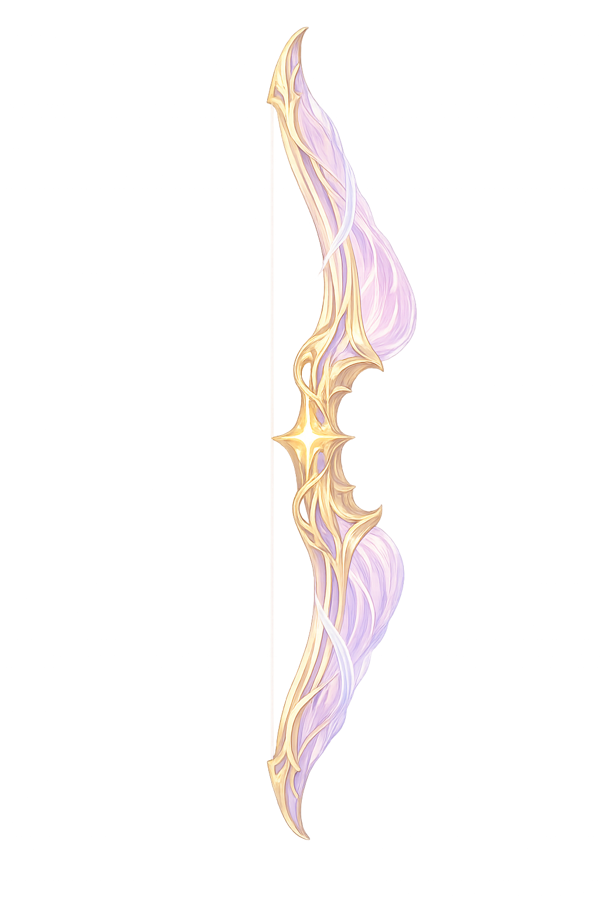|Special tools for Level 4 gameplay. Can be used to shoot down Chaining Platform|Inhale|

Table 1 shows the list of collectables in our game with their descriptions and collection method. For special skill items, we implement the use of inhaling mechanic of from <b>Kirby & the Amazing Mirror</b> to collect them.

  <b>Table 2:</b>
  <i>Levels</i>

|Level|Image|Theme|Special Item|
| -- | -- | -- | -- |
|**Level 1**|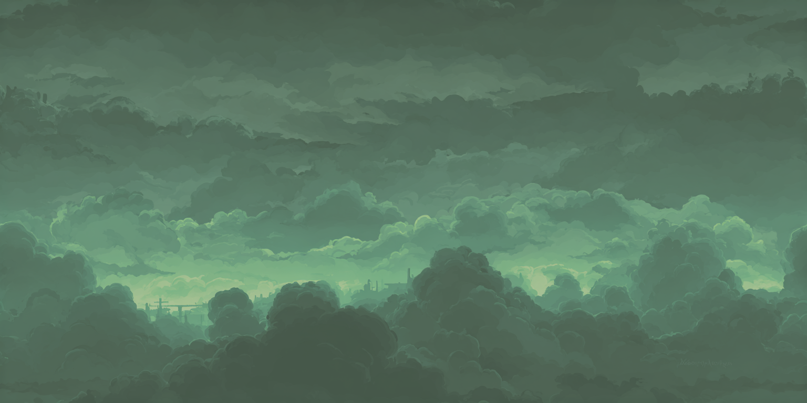|A wrecked chemical factory with toxic fumes.|**Jump Booster**|
|**Level 2**|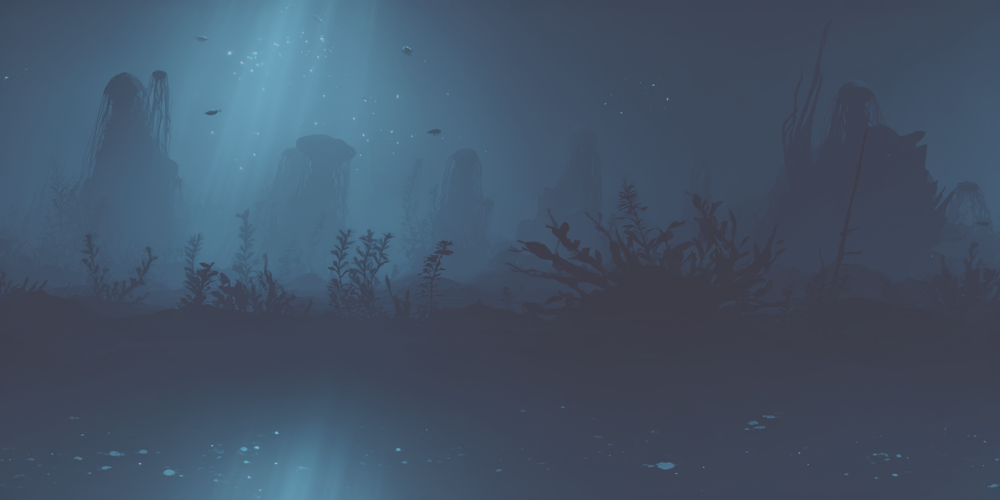|An underwater wreckage of an undersea lab. Bubble collection needed to breath underwater.|**Bubble**|
|**Level 3**|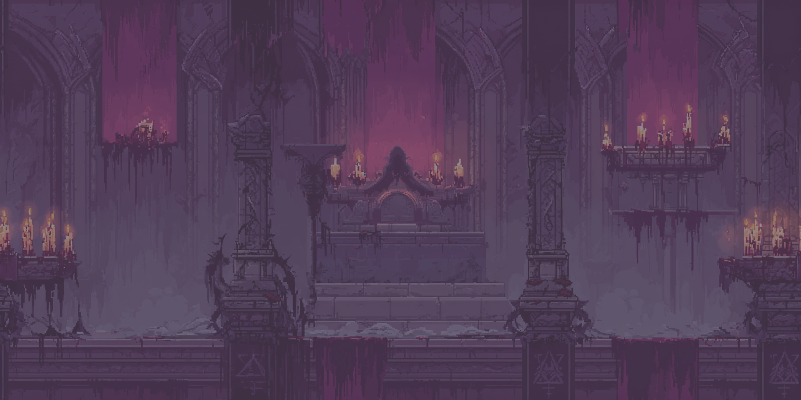|A haunted castle in the island. Several harmful creatures can be found along with a complex environment.|**Shrink Potion**|
|**Level 4**||A city recently destroyed by volcanic eruption with burning particles all over the place. Special chaining platform can be found in this environment where bow and arrows are needed to bring them down.|**Bow**|

Table 2 shows the theme of each level and special items within it. Each level demonstrates different speial twists while the difficulty gradually increases from level 1 to level 4.

  <b>Table 3:</b>
  <i>Platform Tile</i>

|Tile|Example Image|Description|
| -- | -- | -- |
|Regular|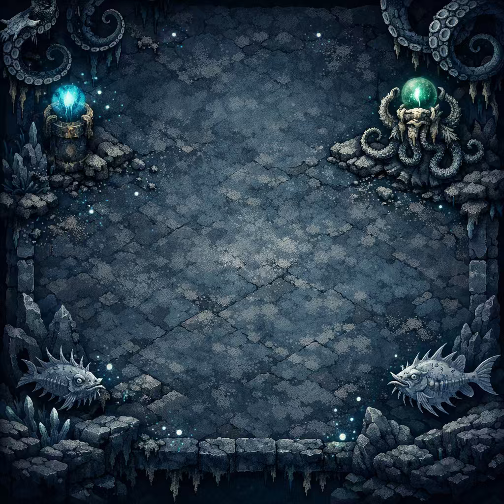 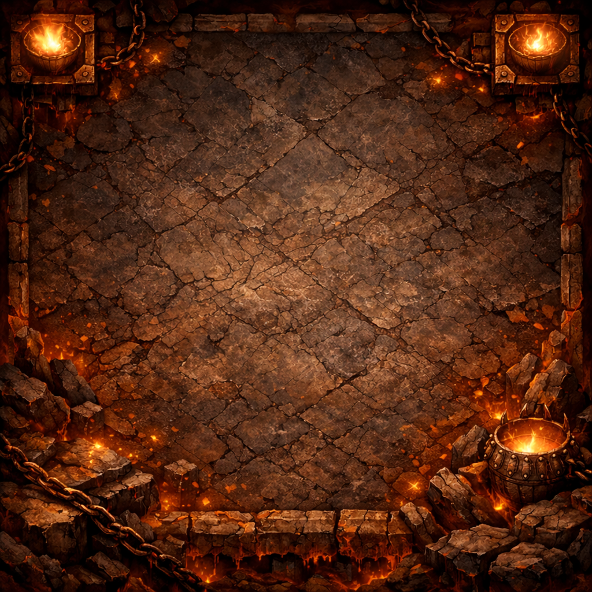|Platforms with regular tile have no special effect on the player. They are just places for the player to stand on. Some of them can be a moving platform which are continuously moving in either in horizontal or vertical directions|
|Cracked|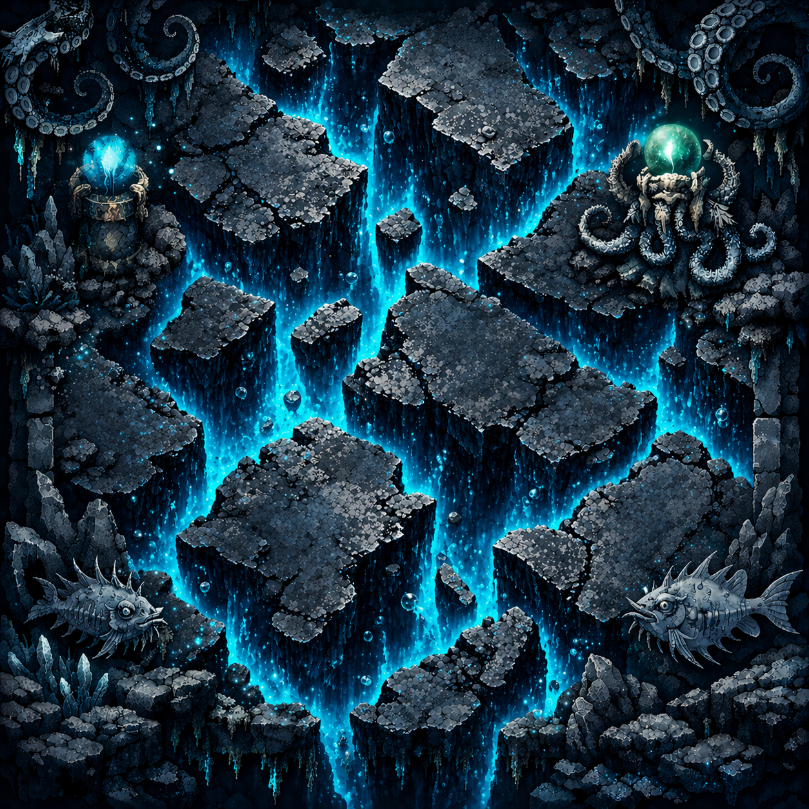 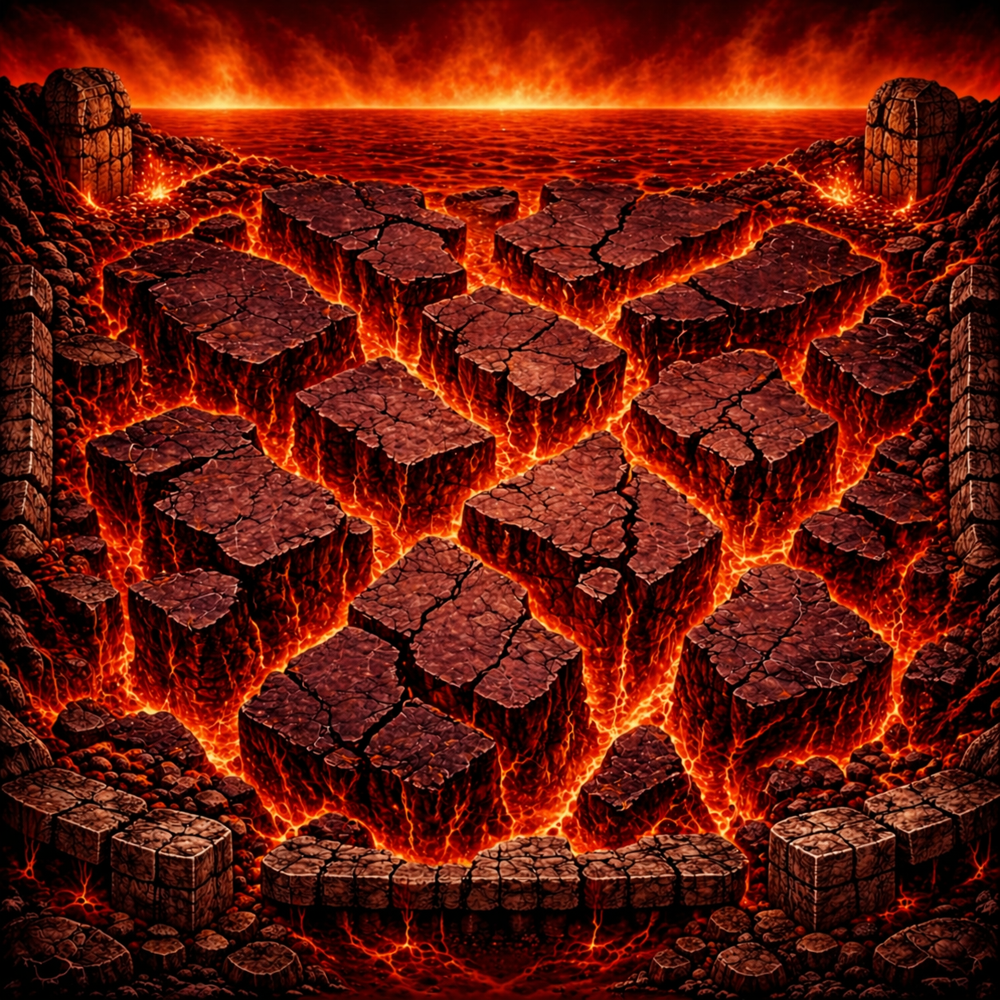|Platforms with slightly cracked tile are available from Level 2 to Level 4. These platform will crack and disappear within just 1 second after landed on, so the player is forced to jump to the next platform faster creating a more challenging theme of the gameplay|

The game environment on each level mainly consists of two main types of platform tiles: regular and cracked. Example images and descriptions of these platform tile mechanisms are described in Table 3.

  <b>Table 4:</b>
  <i>Weapons</i>

|Weapon|Image|Bullet|Description|Stats|
| -- | -- | -- | -- | -- |
|Pistol|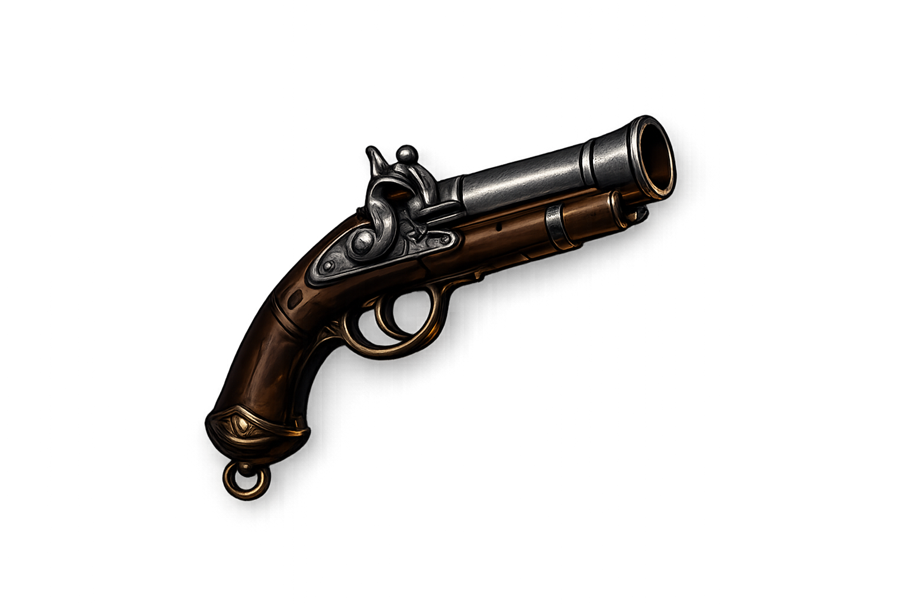|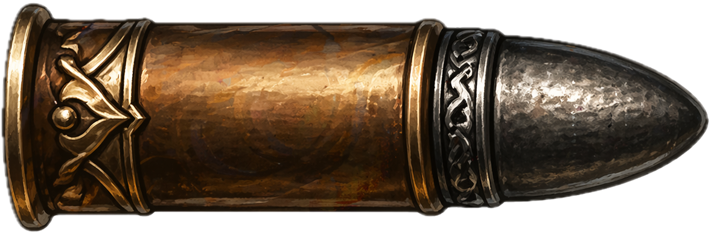|A reliable handgun. Good for single targets.|
• Damage: 10

• Bullet Speed: 8

• Cooldown: 30
|
|Ion Fury|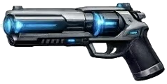||Sleek energy revolver. High precision, low recoil.|
• Damage: 15

• Bullet Speed: 12

• Cooldown: 20
|
|The Shredder|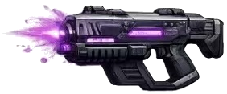|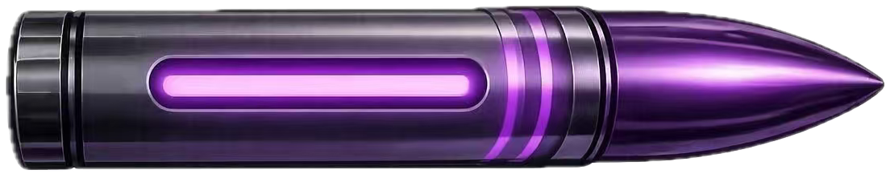|Rapid-fire void repeater. Devastates at high speeds.|
• Damage: 8

• Bullet Speed: 18

• Cooldown: 8
|
|Viper's Kiss|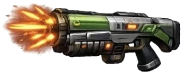||Corrosive burst rifle. Melts through armor easily.|
• Damage: 35

• Bullet Speed: 10

• Cooldown: 35
|
|Titan's Breath|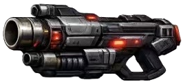|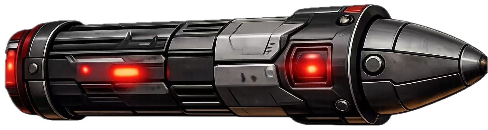|Heavy thermal cannon. Massive damage, slow fire.|
• Damage: 75

• Bullet Speed: 8

• Cooldown: 60
|

Table 4 shows different types of weapons available in our game. These weapons have different stats including damage, bullet speed, and cooldown which allow the player to clearly feel the variety of weapon themes. Pistol is the default weapon given at the start of the game while the four other stronger weapons are available for sale in the camp shop. The implementation of our weapon shop is adapt from <b>CupHead</b>.

## 3. Requirements 

### 3.1 Ideation Process
In the end, we decided that we are going to make our games based on game mechanics and styles of both Kirby & The Amazing Mirror and Cuphead.

Kirby is a colorful platformer where you control Kirby through side scrolling or 3D stages, jumping, floating, and fighting enemies. The core mechanic is Kirby’s ability to inhale foes and objects, then copy enemy powers to gain new attacks and movement options. Levels focus on simple combat, exploration, and light puzzles, with power ups encouraging flexible, playful playstyles.

Cuphead is a run-and-gun boss-rush action game with a 1930s cartoon aesthetic, built around fast, pattern heavy fights. You shoot, dodge, dash, and parry to build special attacks while learning enemy telegraphs and phases. The gameplay emphasizes tight controls, memorization, and precision, with short stages and bosses designed for repeated attempts and mastery.

  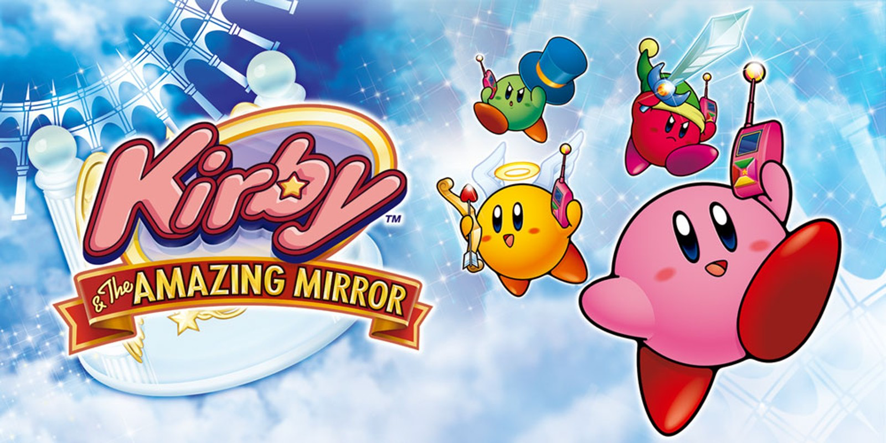
  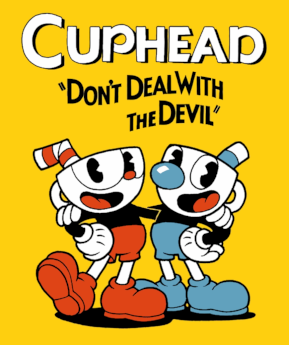

  <b>Figure 3-1:</b>
  <i>Initial Game Ideation</i>

### 3.2 Early Stages Design 
#### 3.2.1 Initial Paper Prototype of Our Game 

  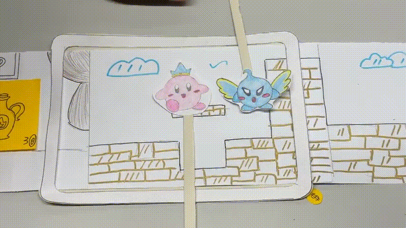
  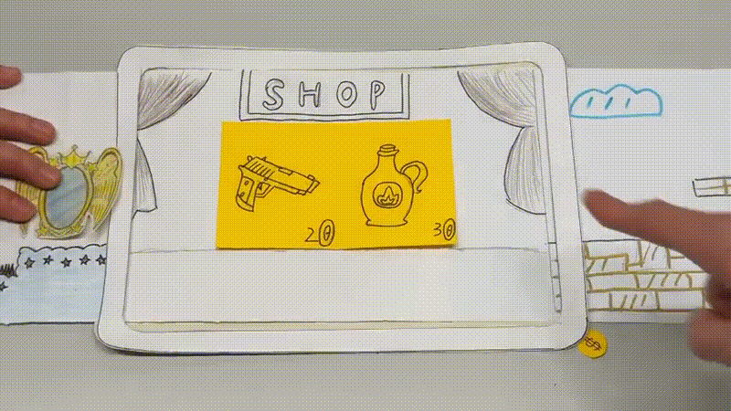
  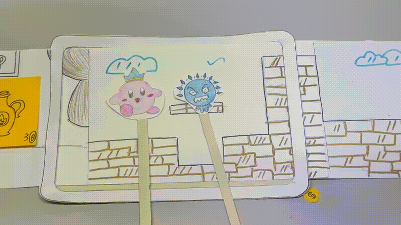

  <b>Figure 3-2:</b>
  <i>Initial Gameplay Prototype</i>

We made a first paper prototype of our game which we initially named it, KirbyHead, based on game twists and mechanics we discussed earlier to see a clear picture of our game functionalities which can lead to a solid development foundation of the game’s codebase

<a href="https://youtu.be/qLW4bnOnACs">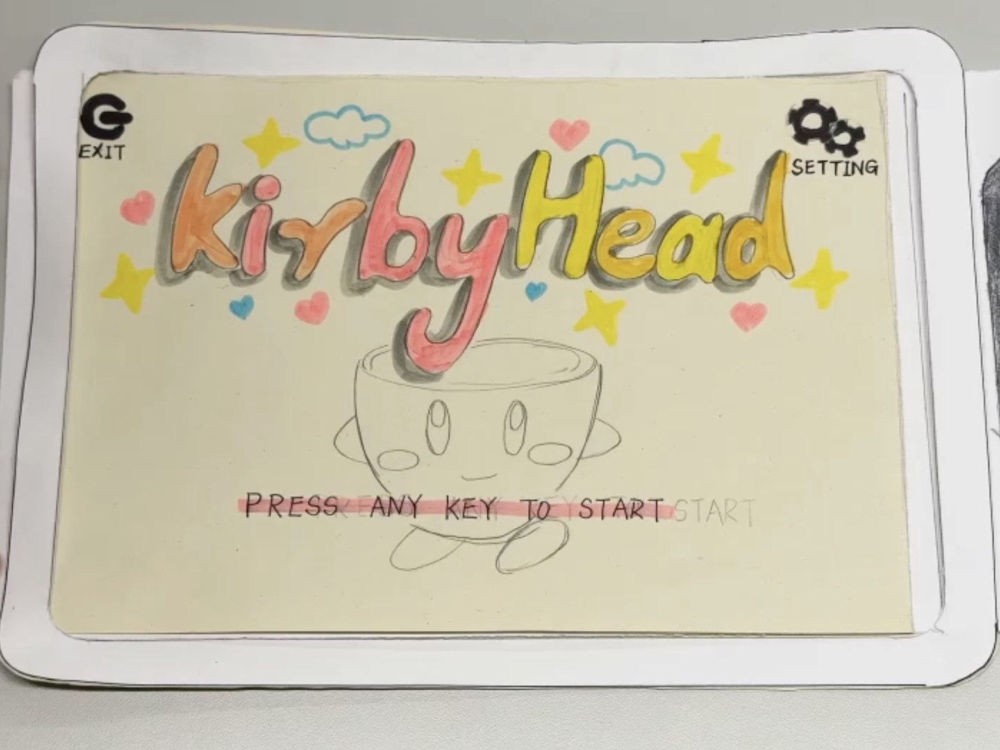</a> 

  <b>Figure 3-3:</b>
  <i>Paper Prototype Video</i>

<a href="https://youtu.be/qLW4bnOnACs">CLICK HERE to watch the video</a>
 
 

The video above shows the initial prototype of our game, KirbyHead, which is the combination of Kirby & the Amazing Mirror and Cuphead. This game implements the core mechanics of both games, including the ability of Kirby to inhale objects and the ability of cuphead to attack enemies by firing bullets. Aside from the mix between the two, we've also added a special twist to the game in the form of various types of allies. By inhaling allies, the main character can temporarily inherit their special abilities.

### 3.3 Identifying Stakeholder

  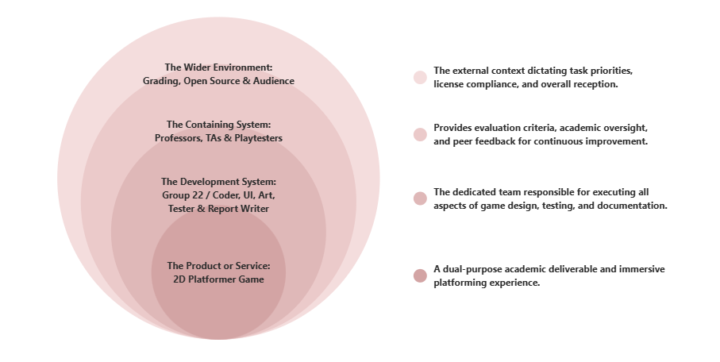

  <b>Figure 3-4:</b>
  <i>Stakeholder Identification</i>

### 3.4 User Stories

  <b>Table 5:</b>
  <i>user stories</i>

| Epic | User Story | Acceptance Criteria | Value | Effort | MoSCoW |
|---|---|---|---|---|---|
| Epic 1: Core Platforming Mechanics | Casual Player: As a casual player, I want smooth and responsive movement controls, so that I can enjoy the game without feeling frustrated. | • Given the player is in an active level, when they press a movement key, then the character begins moving within 100 milliseconds. • Given the player is moving through the level, when they release the movement key, then the character stops or decelerates smoothly and consistently. • Given the player is navigating platforms under normal gameplay conditions, when they move across surfaces, then no noticeable input lag or delay occurs. | High | Low | Must Have |
| Epic 1: Core Platforming Mechanics | Skilled / Hardcore Player: As a competitive player, I want tight collision detection, so that my performance reflects skill rather than system inconsistency. | • Given the player is approaching the edge of a platform within the defined collision tolerance, when they land on the platform, then the landing is registered accurately without slipping or misalignment. • Given the player is navigating a level with enemies, when they come into contact with an enemy, then damage is applied immediately without any perceptible delay. • Given the player is interacting with terrain during normal gameplay, when they move or land on platforms, then no clipping, tunneling, or falling through surfaces occurs. | High | High | Should Have |
| Epic 2: Ability-Merging System | Exploration Player: As an exploration player, I want to discover and merge with different mergeable items, so that I can experiment with new abilities. | • Given the player is near a mergeable item within interaction range, when they press the merge button, then a new merged form is activated successfully. • Given the player has successfully merged with a mergeable item, when the transformation completes, then the newly acquired abilities are immediately available for use. • Given the player performs a merge with a mergeable item for the first time, when the new ability is unlocked, then a clear in-game explanation or tutorial is displayed to explain how the ability works. | High | High | Should Have |
| Epic 2: Ability-Merging System | Curious Player: As a curious player, I want clear feedback when abilities combine, so that I understand what new power I have gained. | • Given the player performs a merge with a mergeable item, when the transformation completes, then a clear visual effect is displayed to indicate the new merged state. • Given the player has an active merged ability, when they view the UI during gameplay, then the ability's icon and name are clearly displayed. • Given the player uses a merged ability, when they trigger the ability, then a distinct animation and sound effect are played to differentiate it from other abilities. | High | Low | Must Have |
| Epic 2: Ability-Merging System | Strategic development team: As a strategic development team, I want different abilities and weapons to be effective in different situations, so that player can plan their approach to each level. | • Given the player is preparing to enter a level, when they select abilities or weapons before starting, then their choices influence how they can approach challenges within that level. • Given the player is in a level with varied enemies or obstacles, when they experiment with different abilities or weapons, then they can discover multiple viable ways to overcome the same challenge. • Given the player is in a challenging situation during gameplay, when they switch to a different ability or weapon, then they can adapt their approach without being forced into a single solution. | High | High | Should Have |
| Epic 3: Currency & Progression System | Progression Player: As a progression-focused player, I want to collect currency during levels, so that I feel a sense of advancement. | • Given the player is navigating a level with collectible currency items, when they touch a currency item, then the currency counter increases immediately and reflects the correct updated value. • Given the player collects a currency item, when the pickup occurs, then a clear sound effect and visual feedback are triggered to confirm the collection. • Given the player completes or exits a level after collecting currency, when the game saves progress, then all collected currency is persisted and correctly reflected in subsequent gameplay sessions. | High | Low | Must Have |
| Epic 3: Currency & Progression System | Progress-Security Player: As a player who values progress security, I want my game progress to be reliably saved, so that I do not lose my achievements. | • Given the player is actively playing and making progress, when an auto-save or manual save is triggered, then the current progress is saved successfully without data loss. • Given the player exits the game and returns later, when they load their game, then all previously saved progress is accurately restored. • Given the player completes a key action, such as finishing a level or collecting important items, when the action is completed, then the game automatically saves progress at that point. | High | Low | Must Have |
| Epic 4: Art & User Experience | New Player: As a new player, I want intuitive UI guidance, so that I can understand mechanics without long tutorials. | • Given the player encounters a new gameplay weapon for the first time, when they approach or interact with it, then a contextual hint is displayed clearly. • Given the player is near an interactive object, when they approach or face the object, then a clear visual cue indicates that the object can be interacted with. • Given the player encounters a hazard during gameplay, when they see the hazard, then it is visually distinct from safe platforms through color, animation, or design. | High | Low | Must Have |
| Epic 4: Art & User Experience | Immersion-Seeking Designer: As an Art designer who values immersion, I want a consistent and original art style, so that the game world feels cohesive. | • Given the player is progressing through different levels, when they observe environments, characters, and objects, then the visual style remains consistent in color, lighting, and artistic design. • Given the player is interacting with the game interface, when UI elements are displayed during gameplay, then they match the overall art direction in style, color scheme, and visual language. • Given the player is playing the release version of the game, when they encounter visual assets during gameplay, then no placeholder, missing, or unpolished assets are visible. | High | High | Should Have |

### 3.5 Use Case Diagrams and Specifications

This use case diagram illustrates the main interactions between the player and the game system. It presents the overall functional structure of the project, including the Loader, Camp, Maps, Shop, and Settings modules, as well as the relationships between core gameplay actions and supporting system features.

  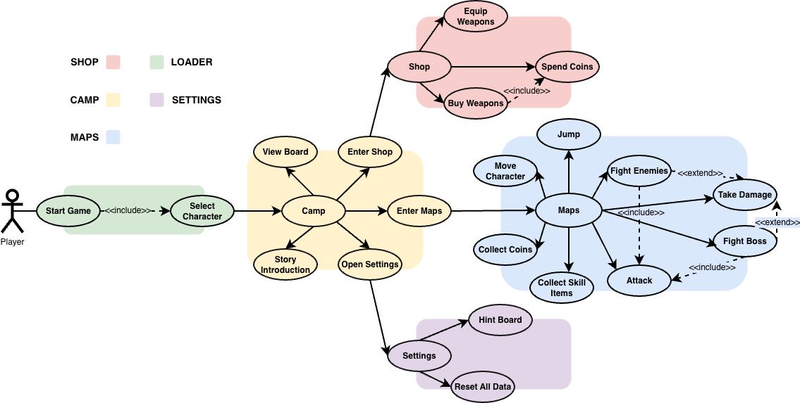

  <b>Figure 3-5:</b>
  <i>Use-case Diagram</i>

The following table presents the use case specifications for the core functions of the game system. Developed from the use case diagram, it provides a more structured description of the main interactions between the player and the system. Each use case is organised into Basic Flow and Alternative Flow. The Basic Flow describes the standard sequence of actions under normal conditions, while the Alternative Flow outlines possible exceptions, failures, or conditional variations during the interaction process.

#### 3.5.1 Use Case Descriptions (Game Flows)

  <b>Table 6:</b>
  <i>use case</i>

| Feature / Action | Basic Flow (Success Path) | Alternative Flow (Exceptions) |
| :--- | :--- | :--- |
| **Start Game** | 1. Player launches game and selects **Start Game**   2. System moves to character selection   3. Player selects character and enters **Camp Scene** | If the player closes the game, the session ends. |
| **Enter Shop** | 1. Player selects **Enter Shop**   2. System opens shop interface   3. Available weapons are displayed | If the shop fails to load, the player is returned to the camp. |
| **Buy Weapons** | 1. Player selects a weapon   2. System checks balance and deducts coins   3. Weapon is added to inventory | 1. Insufficient coins: Purchase is rejected   2. Player cancels: No transaction is completed |
| **Enter Maps** | 1. Player selects **Enter Maps** and enters gameplay area   2. Player can move, jump, fight, and use skills | If the map fails to load, the system returns the player to the camp. |
| **Open Settings** | 1. Player selects **Open Settings**   2. Adjust music, return to selection, or exit game | 1. Close menu: Return to camp   2. No option selected: No changes saved |

## 4. Design

### 4.1 System Architecture
The system follows a four-layer architecture, with the class diagram clearly showing the key components in each layer:

- **Core Control Layer:** The `SceneManager` acts as the central hub, coordinating the `AssetManager` for asset handling, the `GameState` for managing persistent data, and the `LevelBuilder` for environment construction and world initialization.
- **Entity Layer:** This layer includes game entities such as `Player`, `Enemy`, `Minion`, `Boss`, `SummonerBoss` and their subclasses, as well as the `Projectile` system, `Platform`, `Checkpoint`, `Collectable`, and `World`. These components use inheritance and composition to support diverse and dynamic behaviors. The `InteractionManager` class is the core interaction system of the game, responsible for handling all collision and combat logic between game entities.
- **UI Layer:** The `DialogueManager` and `InstructionUI` classes manage the interactive user interface and narrative elements. Scene transitions throughout the game are handled by the `SceneManager` class, while the `AnimationManager` manages visual frame updates during gameplay. Classes such as `StatsBar`, `EntityOverlay`, and `SystemControls` use specialized rendering methods for the efficient display of health, abilities, and navigation icons.
- **Communication Layer:** The `SceneManager` class uses a state-switching pattern to decouple different modules. For example, a victory event in the `BossScene` can trigger a transition back to the `CampScene` while updating the shared `GameState` with collected coins.

### 4.2 Class Diagram

```mermaid
classDiagram
direction BT
class AbilityManager {
   constructor(player) 
   draw() void
   drawAimLine() void
   resetBubbleState() void
   resetSkills() void
   handleInput() void
   setSkill(skillType, duration: number) void
   update() void
   updateSurvival() void
   fireBullet() void
   fireArrow() void
   activateBubble(count: number) void
   drawInhaleEffect() void
}
class AnimationManager {
   constructor(entity, sprites, animationSpeed: number) 
   draw(x, y, flipX: boolean, visualW: null, visualH: null, alignment: string) void
   update(newState, loop: boolean) void
}
class Arrow {
   constructor(x, y, vx, vy) 
   show() void
   update() void
}
class AssetManager {
   constructor() 
   trackLoad(path, type: string, callback: null) any
   getImg(key) any
   loadLevelAssets() void
   loadSpriteSheet(path, frameW, frameH, frameCount, callback) void
   preload() void
   getProgress() any
   getFont(key: string) any
   getLevelAssets(index) any
}
class BaseScene {
   constructor() 
   draw() any
   drawSystemUI(tf: null, warnLoss: boolean, target: string) void
   handleExitInput() boolean | boolean
   keyPressed() void
   drawModalButton(r, label, enabled, onClick) void
   drawIcon(img, rect, scale) void
   mousePressed() any
   drawExitPrompt(targetScene: string, warnLoss: boolean) void
   update() any
   onEnter(data) void
   handleSystemClick() any
   onExit() void
   getContainTransform(img) TransformData
   handleGlobalInput() boolean | boolean
   inRect(px, py, r) boolean | any
   any isInputBlocked
}
class Boss {
   constructor(x, y, sprites, config) 
   land() void
   show() void
   update() undefined | Slash | null
   takeDamage(amount) void
}
class BossScene {
   constructor() 
   checkCollisions() void
   resetScene() void
   drawVictoryPopup() void
   draw() void
   keyPressed() void
   showInstructions() void
   mousePressed() void
   exitToCamp() void
   update() void
   onEnter(data) void
   drawUI() void
   onExit() void
}
class Bow {
   constructor(x, y) 
   onCollect(player) void
   show() void
}
class Bubble {
   constructor(x, y) 
   onCollect(player) void
   show() void
}
class Bullet {
   constructor(x, y, dir, config) 
   show() void
   update() void
}
class CampScene {
   constructor() 
   draw() void
   keyPressed() void
   enterDoor(n) void
   showInstructions() void
   drawTooltip(label) void
   mousePressed() void
   hotspotToScreen(img, hotspot) null | Rect
   drawHotspotsOverlay(tf) void
   renderInteractions(tf) void
   onEnter() void
   screenToImage(mx, my, tf) null | Point
   handleAction(action, val) void
   preload() void
}
class ChainPlatform {
   constructor(x, y, w, h, img, targetY) 
   getBounds() Bounds
   drawChains() void
   triggerBreak() void
   show() void
   update() void
   resolve(entity, world) boolean | any
}
class CharSelectScene {
   constructor() 
   draw() void
   keyPressed() void
   mousePressed() void
   getSelectButtons(tf) ButtonData
   drawHeader(tf) void
   drawJournalContent(tf) void
}
class Checkpoint {
   constructor(x, y, frames) 
   show() void
   update(player) boolean | boolean
}
class Coin {
   constructor(x, y) 
   onCollect(player) void
   show() void
   update(player) void
}
class Collectable {
   constructor(x, y, w, h) 
   onCollect(player) never
   handleInhale(player) void
   drawDebug() void
   handleTouchCollect(player) void
   update(player) void
   respawn() void
}
class DialogueManager {
   constructor(lines) 
   draw(tf, scene) void
   start() void
   skip() void
   update() any
   _drawBtn(r, label, col, scene) void
   advance() void
}
class DiffSelectScene {
   constructor() 
   draw() void
   keyPressed() void
   showInstructions() void
   mousePressed() void
   getDifficultyButtons(tf) ButtonData
}
class Enemy {
   constructor(x, y, sprites, config) 
   die() void
   show() void
   update(platforms) void
   checkPlatformEdges(platforms) void
   takeDamage(amount) void
}
class Entity {
   constructor(x, y, w, h, hp, speed) 
   checkCollision(other) any | boolean
   applyPhysics() void
   takeDamage(amount) void
}
class EntityOverlay {
   draw(entity) void
   drawChargeBar(player) void
   drawBubbles(player) void
   drawEnemyHP(enemy) void
}
class GameObject {
   constructor(x, y, w, h) 
   getBounds() Bounds
   intersects(other) any
   show() never
   update() never
   getOverlap(other) OverlapData
}
class GameState {
   constructor() 
   load() void
   setSelectedCharacter(charObj) void
   save() void
   unlockLevel(index) void
   addCoins(amount) void
   isOwned(itemId) any
   equipWeapon(itemId) void
   getItemData(itemId) any
   sellItem(itemId) boolean | boolean
   setDifficulty(level) void
   purchaseItem(itemId) boolean | boolean
   resetRun() void
}
class GameplayScene {
   constructor() 
   handleResize() void
   draw() any
   mousePressed() any
   applyCanvasMode() void
   restoreFullCanvasMode() void
   onEnter() any
   onExit() void
}
class HintBoardScene {
   constructor() 
   draw() void
   setup() any
   keyPressed() void
   mousePressed() void
   onEnter(data) void
}
class Hotspot {
   constructor(id, label, x, y, w, h, onClick) 
   contains(ix, iy) any
}
class InstructionUI {
   constructor() 
   draw() void
   drawHighlight(r) void
   drawBox() void
   show(input, target: null) void
   getCurrentTarget() any | null
   hide() void
   advance() void
}
class InteractionManager {
   handleCombat(player, enemies, bullets) void
   updateProjectiles(projectiles) void
   resolveHitGroup(projectiles, target, onHit) void
   handleWorldLimits(player, world) void
   handlePuzzles(bullets, platforms) void
}
class JumpBooster {
   constructor(x, y) 
   onCollect(player) void
   show() void
}
class LevelBuilder {
   build(world, data, levelAssets) void
}
class LevelScene {
   constructor() 
   draw() void
   drawLoadingScreen() void
   keyPressed() void
   buildLevel(doorNumber) void
   showInstructions() void
   mousePressed() void
   onEnter() void
   drawUI() void
}
class LoadingScene {
   constructor(bootImg) 
   drawLoadingUI(progress, tf) void
   draw() void
}
class Minion {
   constructor(x, y) 
   show() void
   tryShoot() null | Bullet
   update() void
   takeDamage(amount) void
}
class MovingPlatform {
   constructor(x, y, w, h, img, rangeX: number, rangeY: number) 
   show() void
   update() void
}
class Platform {
   constructor(x, y, w, h, img) 
   handlePlatformTriggers(entity, world) void
   show() void
   resolve(entity, world) boolean | boolean
   update() any
}
class Player {
   constructor(sprites) 
   handleKeyPress() void
   move() void
   reset(startX, startY) void
   land() void
   float() void
   isInhaling() any
   isMoving() any
   updateHurt() void
   show() void
   update() void
   isAttacking() any
   getVisualSize(img) VisualSize
   applyPhysics() void
   takeDamage(amount) void
}
class Projectile {
   constructor(x, y, w, h, vx, vy) 
   update() void
}
class SceneManager {
   constructor() 
   switch(key, data) void
   draw() void
   setup() void
   start() void
   keyPressed() void
   initLoader(bgImg) void
   initGameScenes() void
   windowResized() void
   mousePressed() void
   preload() void
}
class SettingsScene {
   constructor() 
   draw() void
   keyPressed() void
   mousePressed() void
   onEnter(data) void
}
class ShopScene {
   constructor() 
   drawInventoryBar() void
   draw() void
   getInfoPanelRect(anchor) Rect
   keyPressed() void
   getItemAnchor(itemId) any
   slotToScreen(slot) Rect
   showInstructions() void
   mousePressed() void
   drawShelf() void
   onEnter() void
   drawBuyModal() void
   drawInfoPanel() void
   drawItemSlot(r, itemId, isSelected, isEquipped: boolean) void
   drawHeader() void
}
class ShrinkPotion {
   constructor(x, y) 
   onCollect(player) void
   show() void
}
class Slash {
   constructor(x, y, vx, vy, w, h, damage) 
   show() void
}
class StatsBar {
   constructor() 
   drawEquippedWeapon(x: number, y, tf: null) void
   draw(player, coins, showCoins: boolean, unsaveCoins: number) void
   drawDifficulty(difficulty) void
   renderHeart(x, y, img, alpha: number) void
   drawBossHealth(boss) void
   drawCoins(amount, unsavedAmount: number, x, y, tf: null) void
   drawHearts(hp, maxHp) void
}
class SummonerBoss {
   constructor(x, y, sprites, config) 
   show() void
   update() undefined | null
   spawnMinion() void
}
class SystemControls {
   constructor(scene) 
   handleClick() boolean | boolean
   draw(tf: null) void
   _renderIcon(img, r, baseScale: number) void
}
class TitleScene {
   constructor() 
   draw() void
   setup() any
   drawStartPrompt(tf) void
   keyPressed() void
   mousePressed() void
}
class VanishablePlatform {
   constructor(x, y, w, h, img) 
   reset() void
   show() void
   update() void
}
class World {
   constructor(player, levelData, levelAssets) 
   spawnArrow(x, y, vx, vy) void
   updateCamera() void
   show() void
   spawnBullet(x, y, dir, bulletConfig) void
   update() void
   resetPlayer() void
   drawParallax(img, scroll) void
   respawnPlayer() void
}

Arrow  -->  Projectile 
Boss  -->  Entity 
BossScene  -->  GameplayScene 
Bow  -->  Collectable 
Bubble  -->  Collectable 
Bullet  -->  Projectile 
CampScene  -->  BaseScene 
ChainPlatform  -->  Platform 
CharSelectScene  -->  BaseScene 
Checkpoint  -->  GameObject 
Coin  -->  Collectable 
Collectable  -->  GameObject 
DiffSelectScene  -->  BaseScene 
Enemy  -->  Entity 
Entity  -->  GameObject 
GameplayScene  -->  BaseScene 
HintBoardScene  -->  BaseScene 
JumpBooster  -->  Collectable 
LevelScene  -->  GameplayScene 
LoadingScene  -->  BaseScene 
Minion  -->  Entity 
MovingPlatform  -->  Platform 
Platform  -->  GameObject 
Player  -->  Entity 
Projectile  -->  GameObject 
SettingsScene  -->  BaseScene 
ShopScene  -->  BaseScene 
ShrinkPotion  -->  Collectable 
Slash  -->  Projectile 
SummonerBoss  -->  Boss 
TitleScene  -->  BaseScene 
VanishablePlatform  -->  Platform 
```

  <b>Figure 4-1:</b>
  <i>Class Diagram</i>

Figure 4-1 represents our final class diagram which shows the overview of our project structure. The project is built upon core classes such as <b>GameObject</b> which is a parent class for all objects inside the game and <b>BaseScene</b> which is a parent class for all scenes. 

<b>GameObject</b> provides functions such as <b>intersects</b> and <b>getOverlap</b> which are used to detect the interaction between each object in the game. From this foundation, seeveral classes are inherited from the <b>GameObject</b>. <b>Entity</b> class provides the logic for living characters like the <b>Player</b> and <b>Boss</b> ensuring they all follow the same foundational rules for physics and collision, while <b>Platform</b> and <b>Collectable</b> define the interactive environment in the game. These relationships are further supported by manager classes like the <b>InteractionManager</b> which manages the interaction between all game objects and <b>AbilityManager</b> which is the central place to control <b>Player</b> ability.

### 4.3 Behavioral Diagrams

In this section, we demonstrate behavioral diagrams of two core processes of our game: level intialization and game logic loop. The full explanation of both processes are as follows.

  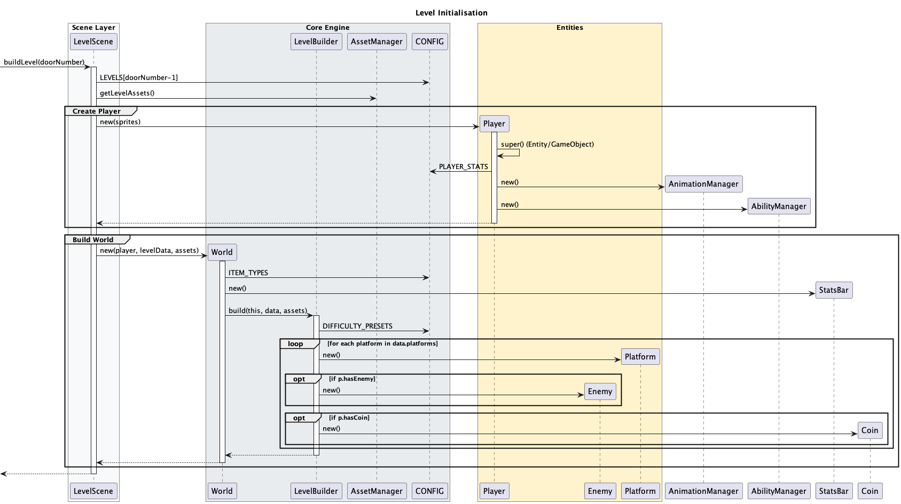

  <b>Figure 4-2:</b>
  <i>Level Initialization Behavioral Diagram</i>

Figure 4-2 demonstrates the process of level initialization. First, the LevelScene <b>buildLevel</b> function receives the door number selected by the user. The door number is used to fetch specific config data and graphic assets from <b>CONFIG</b> and <b>AssetManager</b>, respectively. 

A new <b>Player</b> object is initiated from character sprites retrieved from the <b>AssetManager</b>, while player's stats are pulled from <b>CONFIG</b>. Along with the player, new <b>AnimationManager</b> and <b>AbilityManager</b> instances are also created. <b>AnimationManager</b> manages the player's animation based on their current state, while <b>AbilityManager</b> controls special abilities gained by collecting items within the level.

Once the player is established, a <b>World</b> object is instantiated to manage the simulation loop. A new instance of <b>StatsBar</b> is also created to display crucial information to the user such as health points, coin counts, and the equipped weapon. The construction of the environment is then delegated to the <b>LevelBuilder</b> which retrieves difficulty presets from <b>CONFIG</b> before iterating through the level's config data. These presets contain multiplication ratios used to scale enemy and boss helth points and damage according to the selected difficulty level. For each entry in the dataset, the builder creates a new <b>Platform</b> and instantiates an <b>Enemy</b> or <b>Coin</b> based on the flags defined in the configuration of each platform. This loop ensures that the physical world and its interactive entities are ready for play before the level starts.

  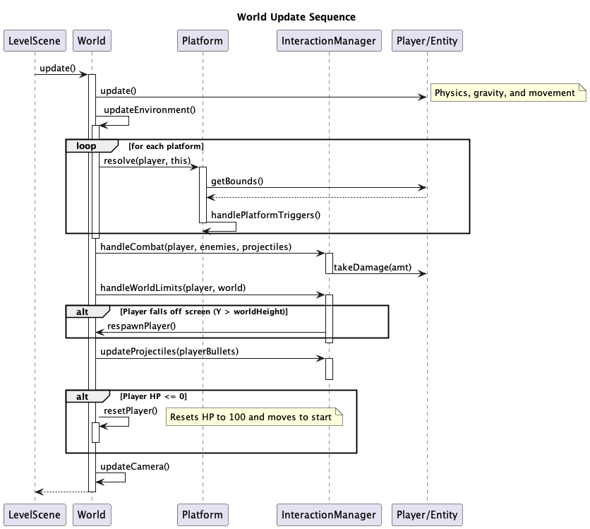

  <b>Figure 4-3:</b>
  <i>Game Logic Loop Behavioral Diagram</i>

Figure 4-3 illustrates the game simulation loop managed by the <b>World.update()</b> which is triggered every frame by the <b>LevelScene</b>. The cycle begins by updating the <b>Player</b> and other <b>Entities</b> processing their internal physics logic, including movement and gravity. Then, the loop iterates through all instances of <b>Platform</b> to resolve collisions involving the <b>Player</b> and other <b>Entities</b>. Certain platforms may contain special triggers that are activated when the <b>Player</b> steps on them.

Core interaction logic is then delegated to <b>InteractionManager</b> which handles combat resolution, projectile lifecycles, and world boundary enforcement. This manager ensures that all <b>Entities</b> take damage correctly during combat and monitors world limits to prevent the <b>Player</b> from walking out of bounds. It also detects whether the <b>Player</b> has fallen off the screen, triggering <b>respawnPlayer()</b> if necessary. In this case, <b>Player</b> is sent to the latest <b>Checkpoint</b> with a 20-point health reduction penalty for the fall.

If the <b>Player</b>'s health points reach zero, the <b>World</b> executes <b>resetPlayer()</b> which fully restores the player's health points and sends them back to the beginning of the level.

Finally, the cycle ends by updating the camera position to ensure that the viewport on remains centered and follows <b>Player</b>'s movement.

## 5. Implementation

To ensure high scalability, we implemented a strict modular architecture divided into three independent layers following Object Oriented Design (OOD) approach:
1. UI Layer : Interfaces are abstracted into independent scenes (e.g.,CampScene.js) with onEnter/onExit hooks. sketch.js delegates native events (draw, mousePressed) to a singleton SceneManager, which routes them to the active scene, ensuring absolute UI state isolation.
2. Physics & Logic Layer : A base GameObject class standardizes rendering and boundaries, from which entities like Player, Enemy, and Platform are derived. The World.js container simply calls update() and show() polymorphically on child objects within the frame loop.
3. Data Layer : Level assets (terrain, items, backgrounds) are completely decoupled from logic into pure configuration files (src/levels/LevelX.js). World.js acts as a parser, dynamically instantiating the world based on the level index to separate code from game assets.

During implementation, we primarily faced and solved two technical challenges:

### 5.1 Challenge 1: Alignment of Hitbox Design and Visual Presentation
#### Challenge:

 
Utilizing the raw dimensions of game sprites for collision detection often results in poor "game feel." Due to transparent margins in many image assets, hitboxes that perfectly match image sizes can lead to "unfair" outcomes—such as players taking damage before visual contact is made or falling off platforms while their character's feet still appear to be on the edge. Furthermore, the vast scale difference between massive bosses and small projectiles necessitates a flexible boundary logic; a rigid, uniform approach would create a noticeable disconnect between visual cues and physical reality.

#### Solution:

 
To ensure physical detection aligns with player intuition, a "Visual-Physical Decoupling" strategy was implemented:

1. Standardization of Boundary Calculations: A universal getBounds() method was established within the GameObject.js base class. This method calculates boundaries based on manually defined width (w) and height (h) properties rather than raw sprite dimensions, ensuring a consistent and efficient detection standard across the entire project.

2. Decoupling of Render and Physical Dimensions: For large-scale entities like bosses, the system distinguishes between visual dimensions (visualW/H) and physical collision dimensions (w/h). By leveraging alignment settings within the AnimationManager, precise positioning (such as grounding a boss’s feet) is maintained, preventing hitbox misalignment caused by animation scaling.

3. Targeted Boundary Extension for Special Objects: For unique elements such as the ChainPlatform, the boundary retrieval method is overridden to allow the detection zone to extend upward under specific states. This facilitates accurate interaction across the entire length of the chain without the need for redundant or complex code.

<table align="center" style="border: none; border-collapse: collapse; width: 100%;">
  <tr style="border: none;">
    <!-- 第一张图 -->
    <td align="center" style="border: none; width: 32%;">
      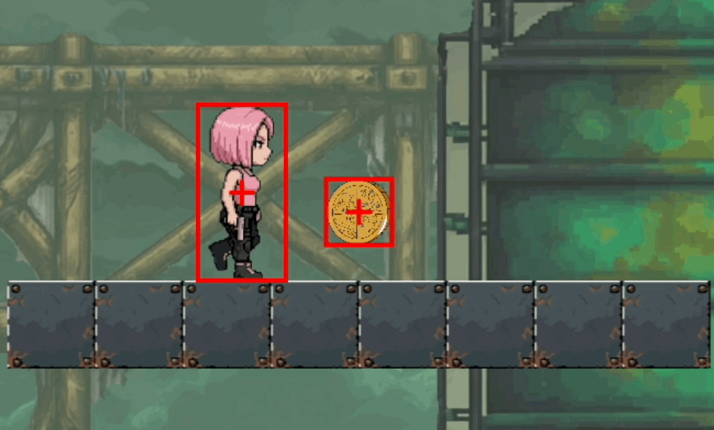
       
      <b>Figure 5-1</b>
    </td>
    <!-- 第二张图 -->
    <td align="center" style="border: none; width: 32%;">
      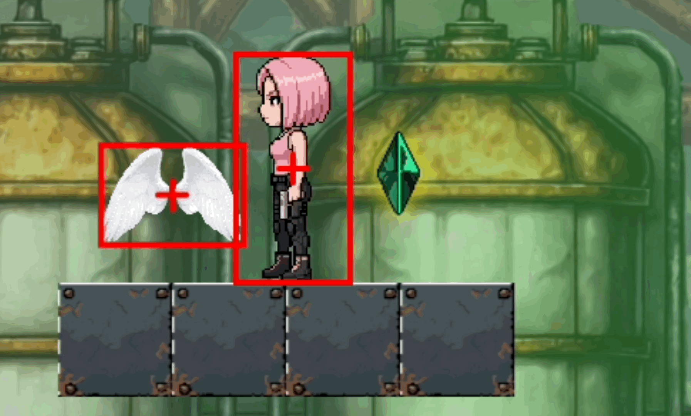
       
      <b>Figure 5-2</b>
    </td>
    <!-- 第三张图 -->
    <td align="center" style="border: none; width: 32%;">
      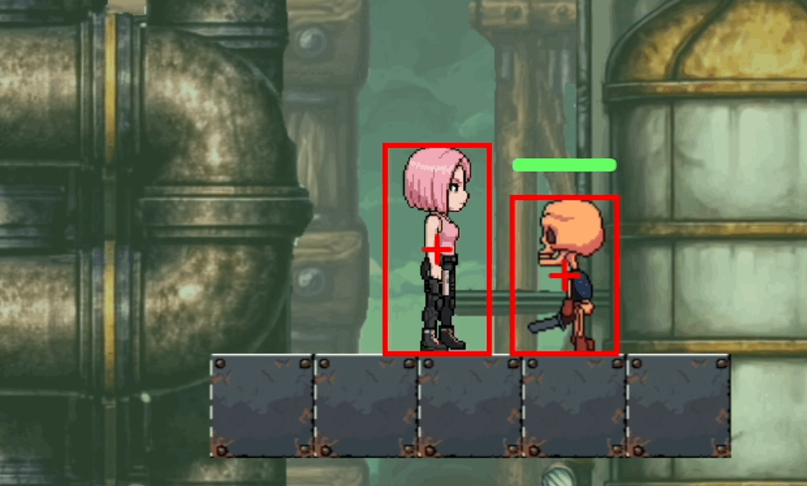
       
      <b>Figure 5-3</b>
    </td>
  </tr>
</table>

### 5.2 Challenge 2: Physics Collision Detection and Positional Correction in 2D Platformers
#### Challenge:

 
One of the most complex aspects of developing a platformer is precisely determining whether a character has "landed on a platform," "hit a side wall," or "collided with the ceiling." Relying solely on basic rectangular overlap detection often leads to erratic physics logic: characters may become stuck inside blocks (clipping) or bypass floors entirely due to high falling speeds (tunneling). Additionally, ensuring a character remains securely on a moving platform without sliding off is a significant challenge in maintaining a polished "game feel."

#### Solution:

 
To resolve these physical inaccuracies and unnatural movements, a coordinate correction logic was integrated into the resolve collision handling mechanism within Platform.js:

 
1. Directional Collision Differentiation: The system moves beyond simple collision detection by utilizing a getOverlap method to calculate the depth of overlap across all four directions. By comparing these values, the program accurately distinguishes whether the character is falling from above or impacting from the side or bottom.

 
2. Landing Detection and Positional "Snapping": When a top-down collision is detected, Positional Correction is automatically executed. The character's Y-coordinate is immediately aligned to the top of the platform (p.top - entity.h / 2), and vertical velocity is neutralized. This triggers the land() function to reset jump counts, ensuring the character stands firmly on the surface without visual sinking artifacts.

 
3. Mitigation of Clipping and Tunneling: For non-landing collisions (sides or bottom), the system identifies the axis of minimum overlap and "pushes" the character out in that direction. This ensures that even at high speeds, the character is instantly repositioned outside the collision volume, effectively preventing them from becoming stuck inside walls.

 
4. Velocity Synchronization for Moving Platforms: Within the resolve method, the moving platform’s own velocity (velX and velY) is transferred in real-time to the character currently standing on it. This ensures the character moves in perfect synchronization with the platform, providing a stable and responsive control experience.

<table align="center" style="border: none; border-collapse: collapse; width: 100%;">
  <!-- 第一行图片 -->
  <tr style="border: none;">
    <td align="center" style="border: none; width: 48%; padding-bottom: 20px;">
      
       
      <b>Figure 5-4</b>
    </td>
    <td align="center" style="border: none; width: 48%; padding-bottom: 20px;">
      
       
      <b>Figure 5-5</b>
    </td>
  </tr>
  <!-- 第二行图片 -->
  <tr style="border: none;">
    <td align="center" style="border: none; width: 48%;">
      
       
      <b>Figure 5-6</b>
    </td>
    <td align="center" style="border: none; width: 48%;">
      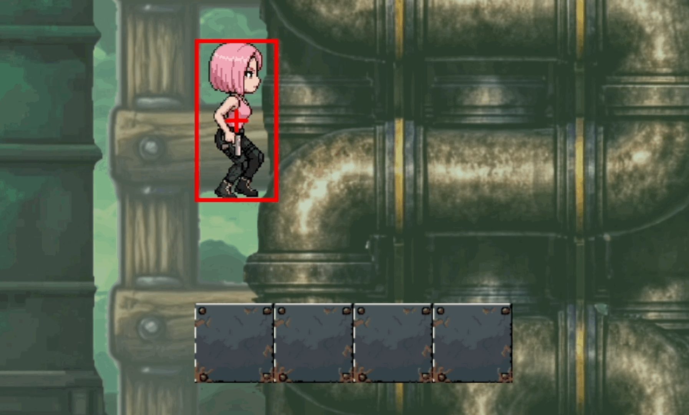
       
      <b>Figure 5-7</b>
    </td>
  </tr>
</table>

## 6. Evaluation

### 6.1 Qualitative Evaluation

 
To gain an in-depth understanding of players’ genuine experiences regarding level design, game difficulty, operational feel, and the overall game concept, we adopted the Think Aloud technique. This method allows us to capture players’ immediate reactions and thoughts during gameplay, helping us identify design strengths and weaknesses while providing strong evidence for subsequent iterations.

#### 6.1.1 Study Design and Participant Recruitment

 
We recruited 14 participants from diverse backgrounds to ensure broad and varied feedback. Their gaming experience ranged from absolute beginners to hardcore players. During the experiment, participants played through all 4 levels in both Easy and Hard modes. Players continuously verbalized their operational strategies, immediate impressions, and feedback regarding level layout, enemy design, item functions, visual effects, and sound effects. After data collection, we organized and coded the textual data to extract the core feedback themes.

#### 6.1.2 Main Feedback Themes
##### 6.1.2.1 Player Movement and Operational Feel

 
Immediate Feedback: The majority of players praised the core movement mechanics, describing the controls as simple, responsive, and easy to pick up, with a nostalgic feel reminiscent of classic games.
Areas for Improvement: Some players noted minor issues, such as the character falling too slowly after a jump and slight input delays. Additionally, players suggested that the transition animations between turning, jumping, and attacking could be smoother to enhance the overall operational feel.

##### 6.1.2.2 Level Difficulty and Challenge

 
Difficulty Balance: Players generally agreed that the Easy mode is highly accessible and beginner-friendly, while the level design hits a "sweet spot" where jumps require skill without feeling unfair.
Combat and Bug Reports: A common critique was that enemy and boss HP (especially the Hard mode boss and Easy mode regular enemies) felt too high, making combat tedious. Players also discovered exploits, such as bosses having attack blind spots at the edges of the map. Furthermore, critical bugs were reported, including broken save points and players being able to continue fighting with zero health.

##### 6.1.2.3 Game Guidance and Information Presentation

 
Tutorial Clarity: While the basic tutorials were straightforward, many players felt the in-game guidance was insufficient. The tutorial text was often described as unclear or easily overlooked.
Missing Instructions: Participants frequently mentioned confusion regarding core mechanics: the double jump, specific item usages (like the bow in Level 4), and the death penalty (being sent back to the start). Most notably, the checkpoint system (the purple gem) was heavily misunderstood, with many players mistaking it for a collectible item rather than a save point. Players also requested visual highlights for interactive UI elements (like the shop) and noted the absence of a victory screen after defeating bosses.

##### 6.1.2.4 Level Layout and Environmental Design

 
Visual and Thematic Performance: The environmental design was highly praised. Players appreciated the clear structure and distinct themes across the 4 levels, noting that each map had unique mechanics and avoided feeling homogenized.
Interaction Suggestions: To elevate the experience, several participants suggested increasing the interactivity of the environments. Instead of the environment serving solely as a background, players recommended adding interactive elements like stackable wooden crates to assist with platforming, which would deepen gameplay engagement.

##### 6.1.2.5 Enemy Design and Item Usage

 
Enemy Behavior: While the classic enemy setup was appreciated, many players found the enemy AI to be overly basic and monotonous. Participants suggested adding ranged attack modes to regular enemies and refining boss mechanics (e.g., providing hints to dodge the Level 1 boss's bullets). The Level 4 boss was specifically called out for having unfinished graphics and poor design.
Item Functionality: Although players found the map-specific items interesting, they felt the overarching item pool lacked originality. Clearer instructions upon picking up new items are necessary to improve strategic usage.

##### 6.1.2.6 Game Pacing and Sound Feedback

 
Pacing Control: The overall game pacing was well-received, with players noting that the 2-3 minute duration per map felt excellent and comfortable.
Sensory Feedback: Feedback regarding the audio was mixed; some found the audio generic and failing to amplify the emotional experience. To increase the “satisfaction” of the combat, players highly recommended adding distinct visual and audio feedback for key actions, such as critical hits and perfect dodges.

#### 6.1.3 Summary and Outlook

 
Through this qualitative evaluation, we have gathered invaluable insights into player movement, difficulty balancing, tutorial clarity, and overall game mechanics. The feedback indicates that while the game has a strong, nostalgic foundation with well-structured levels and accessible controls, there are critical areas requiring immediate attention. Moving forward, our primary focus will be on refining game guidance (especially regarding checkpoints and item usage), balancing enemy HP, fixing game-breaking bugs, and enhancing the audiovisual feedback for combat actions. By addressing these pain points and introducing more dynamic enemy AI and environmental interactions, our continuous iterative refinement aims to create a more polished, engaging, and rewarding experience for players of all skill levels.

### 6.2 Quantitative Evaluation

 
To complement the qualitative feedback and gain objective, measurable insights into the player experience of Island of Rising Sun, we conducted a comprehensive quantitative evaluation.

#### 6.2.1 Study Design and Participant Demographics

 
We recruited 22 participants with varying degrees of platformer experience. Each participant was required to complete all four levels of the game under two distinct conditions: Easy Mode and Difficult (Hard) Mode. This within-subjects design yielded a total of 44 valid questionnaires.
The survey was designed to measure four core dimensions: Basic player information, System Usability Scale (SUS) for overall usability, NASA Task Load Index (NASA-TLX) for perceived cognitive and physical load, and subjective difficulty rankings across the four levels.
Demographics: Male (54.5%), Female (45.5%).
Gaming Experience: Novice (27.3%), Casual (45.4%), Hardcore/Experienced in platformers (27.3%).

  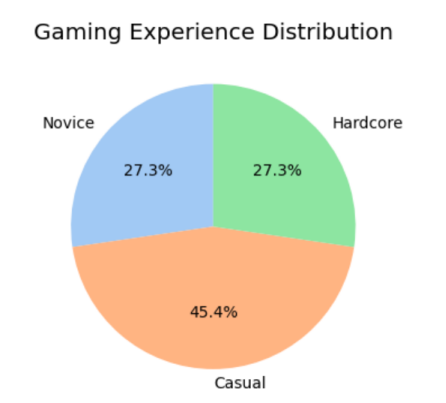

Figure 1: Distribution of participants' prior gaming experience.

#### 6.2.2 System Usability Scale (SUS) Assessment

The SUS is a highly reliable tool for evaluating the usability of a system. A score above 68 is generally considered above average.

  <b>Table 7:</b>
  <i>System Usability Scale (SUS) results by game mode</i>

| Mode | Average SUS Score | Usability Grade | Player Interpretation |
| :--- | :---: | :---: | :--- |
| **Easy Mode** | 82.5 | A | "Excellent. Controls (jumping, buying weapons) are highly intuitive." |
| **Difficult Mode** | 71.2 | C+ | "Good, but the tight jump windows and unforgiving enemy mechanics caused slight frustration." |

 
The results indicate that Island of Rising Sun has a strong foundational UI and control scheme. However, the drop in the Difficult mode suggests that when players are under pressure (e.g., dodging bosses while trying to collect coins), the interface and control responsiveness are perceived as slightly less forgiving.

  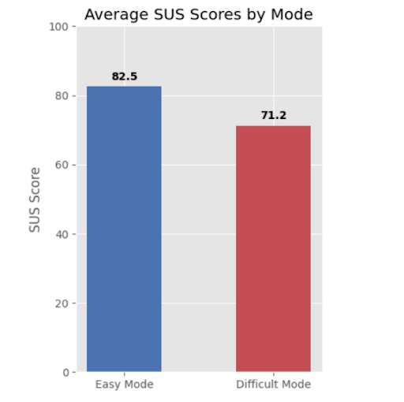

Figure 2: Comparison of average SUS scores between Easy and Difficult modes.

#### 6.2.3 Cognitive Load Assessment (NASA-TLX)
We utilized the NASA-TLX to assess the workload placed on players. It measures six dimensions on a scale of 0 (Very Low) to 100 (Very High).

  <b>Table 8:</b>
  <i>NASA-TLX subscale scores across modes</i>

| Dimension | Easy Mode (Mean) | Difficult Mode (Mean) | Difference |
| :--- | :---: | :---: | :---: |
| Mental Demand | 35.4 | 68.2 | + 32.8 |
| Physical Demand | 42.1 | 75.5 | + 33.4 |
| Temporal Demand | 30.5 | 65.0 | + 34.5 |
| Performance (Inverted)* | 25.0 | 55.4 | + 30.4 |
| Effort | 40.2 | 82.3 | + 42.1 |
| Frustration | 15.6 | 60.8 | + 45.2 |

*\*Note: Lower performance score means the player felt less successful.*

 
Analysis: The data reflects the core mechanics of Island of Rising Sun. In Difficult mode, the demand for precise platform jumping and strategic resource management (collecting coins to buy specific weapons in the shop) significantly increased Physical Demand and Effort. The sharpest increase was in Frustration (+45.2), aligning with the qualitative feedback regarding the unforgiving nature of the Hard mode bosses.

  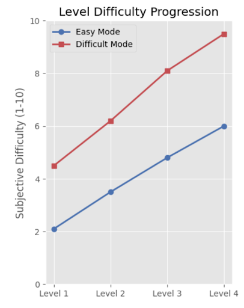

Figure 3: Radar chart visualizing the cognitive and physical load in different modes.

#### 6.2.4 Subjective Level Difficulty Ranking
Participants ranked the subjective difficulty of the 4 levels on a scale of 1 (Easiest) to 10 (Hardest).

  <b>Table 9:</b>
  <i>Subjective difficulty ratings for Levels 1 to 4</i>

| Level | Easy Mode Score | Difficult Mode Score |
| :--- | :---: | :---: |
| Level 1 | 2.1 | 4.5 |
| Level 2 | 3.5 | 6.2 |
| Level 3 | 4.8 | 8.1 |
| Level 4 | 6.0 | 9.5 |

 
Analysis: The progression curve is highly logical. Both modes show a linear increase in difficulty, proving that our level design effectively scales up the challenge. However, Level 4 in Difficult Mode (9.5/10) verges on being overly punitive, indicating a potential need for minor balancing adjustments to boss health or weapon damage scaling.

  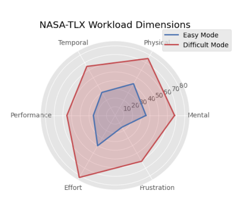

Figure 4: Subjective difficulty progression across the four levels.

#### 6.2.5 Correlation Between SUS and NASA-TLX Scores

 
To understand how game difficulty impacts the player's perception of the game's usability, we conducted a Pearson correlation analysis between the total SUS scores and the overall NASA-TLX workload scores across all 44 questionnaires.
Result: There is a significant negative correlation (Pearson's r = -0.68, p < 0.01) between SUS and NASA-TLX scores.
Conclusion: As the cognitive and physical load increases (higher NASA-TLX), players' rating of the system's usability decreases (lower SUS). This is a critical insight for Island of Rising Sun. It suggests that players are conflating "gameplay difficulty" (e.g., hard-to-kill mobs) with "system usability" (e.g., jumping mechanics). To improve future iterations, we must ensure that when the game gets harder, the controls remain flawlessly responsive, so players blame their own timing rather than the game's operational feel.

  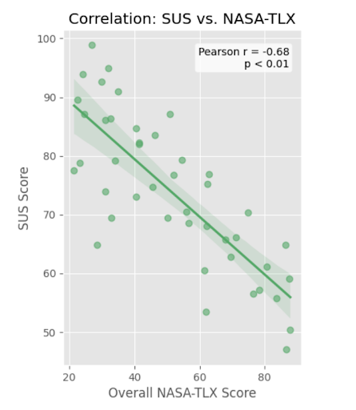

Figure 5: Scatter plot showing the negative correlation between NASA-TLX workload and SUS scores.

### 6.3 Testing

 
To ensure the stability of the platforming mechanics, the integrity of the game’s economy, and the robustness of the underlying architecture, a comprehensive testing workflow encompassing both Black-Box and White-Box testing methodologies was implemented:

#### 6.3.1 Black Box Testing
##### 6.3.1.1. Equivalence Partitioning and Input Validation

 
Rigorous testing was conducted on the input system (A/D for movement, SPACE for jumping).   It was verified that movement remains fluid and that character animations (idle, run, jump) synchronize correctly with the physics engine.   Furthermore, combat inputs using the J (Shoot) key were validated for projectile trajectory.   Additionally, the ESC key was tested to ensure it reliably triggers the "Camp" (menu/pause) state without disrupting the game loop.

##### 6.3.1.2. Functional Testing:

 
Hitboxes for both melee and ranged attacks were refined for accuracy, ensuring that enemy health points (HP) decrement correctly upon impact.   The K (Collect) mechanic was tested to ensure coins are properly added to the player's balance.   We also verified that items are correctly equipped after a successful transaction in the Shop System.   Specific integration tests were conducted for the final Boss encounter to check AI behavior patterns and ensure the game correctly transitions to a "Win" state upon the Boss's defeat.

##### 6.3.1.3. Boundary Testing: 

 
Limit testing was performed on the Shop System to verify that players cannot purchase weapons without sufficient funds.   Verification was also performed on the platform boundaries to ensure the player character remains within the defined world limits and triggers the respawn logic correctly if falling out of bounds.

##### 6.3.1.4. Performance Testing: 

 
The game's performance was monitored via browser developer tools to ensure a stable 60 FPS on Chrome and Firefox during high-intensity sequences.

#### 6.3.2 White Box Testing
##### 6.3.2.1. Code Coverage:

  
Test cases were designed to achieve high branch coverage, particularly in critical game logic such as AbilityManager.handleInput().   Tests ensured all if-else branches were executed, including the specific conditions for character states (isInhaling, isCharging) and verifying that both true and false evaluations of cooldown timers correctly trigger or restrict actions like fireBullet() and fireArrow().

##### 6.3.2.2. Path Testing:

 
We analyzed and validated the logical execution paths within the engine, notably in InteractionManager.handleCombat (). We tested the specific path where a player's projectile intersects with an enemy (bullet.intersects(enemy) evaluates to true), verifying the exact execution sequence: enemy.takeDamage() is called, and the bullet. active flag is subsequently set to false to prevent multiple hit registrations.

##### 6.3.2.3. Unit Testing: 

 
Core classes and utility functions were subjected to strict assertion testing.   We specifically unit tested the GameState class to ensure purchaseItem(itemId) properly checks for this.  isOwned(itemId) and this.  coins < item.  price before deducting funds and updating the ownedItemIds array. Similarly, Player.takeDamage() was tested to guarantee HP calculations correctly account for the invincibilityTimer to prevent instant death from overlapping frames.

##### 6.3.2.4. Memory and Static Analysis:

 
Static analysis tools were utilized to check for undefined variables and ensure proper object instantiation across parent-child structures like GameObject and Entity.  Additionally, memory profiling was conducted to prevent memory leaks during gameplay loops.   We verified that the array filtering mechanisms in World.update() (e.g., this.enemies.filter(e => e.active)) successfully release references to dead enemies, off-screen minion bullets, and collected coins, allowing the JavaScript garbage collector to free up memory efficiently.

## 7. Process 

### 7.1 TeamWork: Project Stages and Task Allocation

To manage the project effectively, we divided the development process into four main stages. Firstly, we conducted game research and defined the twist of the game, so that the project would have a clear gameplay direction from the beginning. Secondly, we confirmed the storyline, built the overall object-oriented programming framework, and developed the core logic and interaction of the main interfaces, while also deciding the key functional modules and the visual style. Thirdly, we refined the detailed gameplay features by improving the platform layouts of each map, completing the interactions and transitions between different pages, and integrating visual assets into the game. Finally, we focused on testing, debugging, and polishing the game, while also preparing the repository materials and final report documentation.

  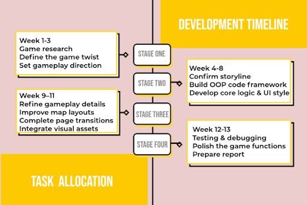

  <b>Figure 7-1:</b>
  <i>Development Timeline</i>

### 7.2 TeamWork: Communication and Collaboration

To maintain effective teamwork throughout the project, we combined both offline and online communication methods. Team members discussed design ideas, gameplay adjustments, and implementation details through face-to-face meetings, which allowed us to exchange opinions more directly and make decisions more efficiently. In addition, we held a regular online meeting every Saturday afternoon to review weekly progress, report completed tasks, and coordinate the next stage of development. This online meeting also gave each member an opportunity to raise technical or design issues they had encountered during the week. To keep communication clear outside meetings, we used shared documents and a Kanban board to record task assignments, monitor development status, and update priorities when necessary. This combination of regular meetings and shared tools helped the team remain organised, transparent, and aligned throughout the project.

  
  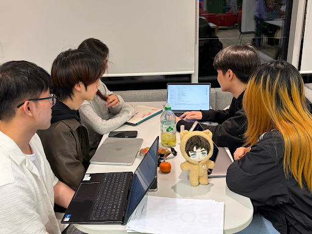

  <b>Figure 7-2:</b>
  <i>Offline and Online Team Communication</i>

In terms of problem solving, our team adopted a collaborative and iterative approach. When a technical issue or design difficulty emerged, we first raised it during our regular meetings or in group discussions so that all members could contribute possible ideas and solutions. If the problem could not be resolved immediately, we would break it down into smaller parts, assign follow-up tasks, and continue investigating it individually before discussing it again in the next meeting. For programming-related issues, we also relied on shared code review, peer discussion, and repeated testing to identify the source of bugs and evaluate whether a solution was effective. In some cases, we adjusted our original plan after discovering that a certain feature was more complex than expected, which allowed us to focus on practical solutions instead of forcing unsuitable designs. This problem-solving process helped us respond to difficulties in a flexible way and ensured that development could continue steadily even when unexpected challenges appeared.

### 7.3 Method and Tools

We adopted an agile and iterative development method throughout the project. Since the game’s mechanics, interface, and accessibility features required continuous refinement, we developed the product in stages rather than following a fixed one-time plan. Regular reviews and adjustments allowed us to respond quickly to new ideas, technical issues, and user feedback. This method helped the team stay flexible and supported steady progress during development.

  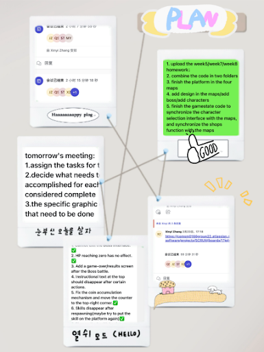

  <b>Figure 7-3:</b>
  <i>Kanban Board</i>

  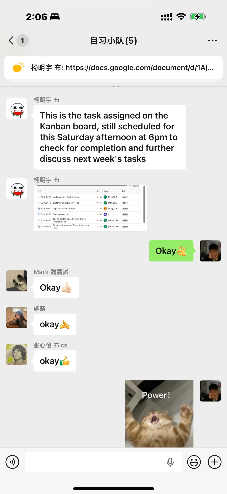

  <b>Figure 7-4:</b>
  <i>WeChat Communication</i>

### 7.4 Outcome

Overall, this process created a clearer and more manageable workflow throughout the project. By combining stage-based planning, regular meetings, and shared collaboration tools, our team was able to coordinate tasks effectively, address problems in time, and incorporate feedback during development. As a result, we completed a more polished and playable final game, together with the required repository materials and report documentation.

  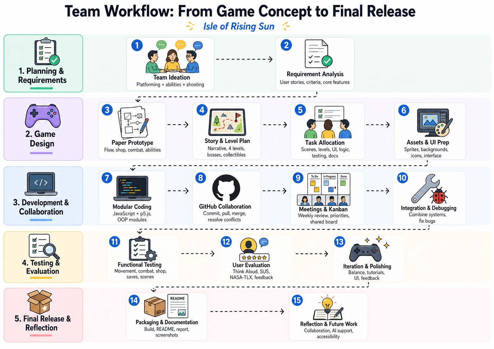

  <b>Figure 7-5:</b>
  <i>Team Workflow</i>

## 8. Sustainability, Ethics, and Accessibility

<table align="center" style="border: none; border-collapse: collapse;">
  <tr style="border: none;">
    <td align="center" style="border: none;">
      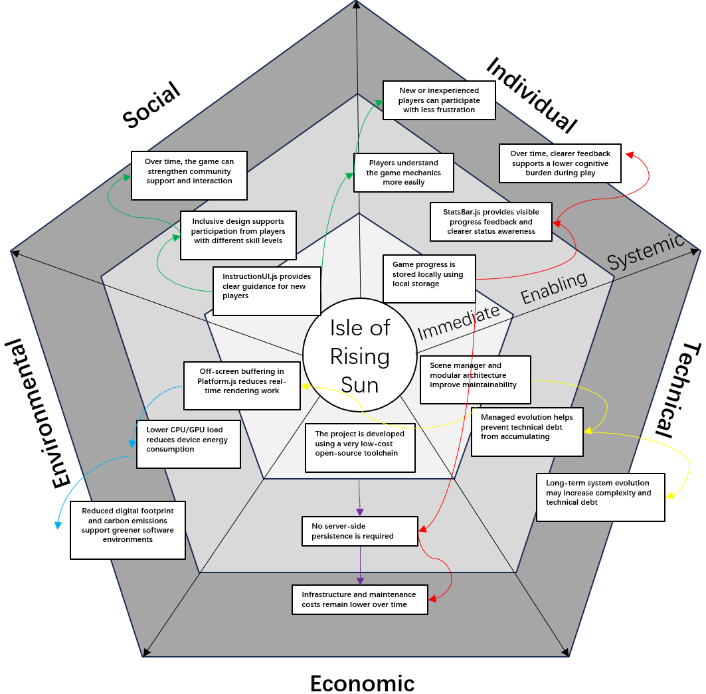
       
      <b>Figure 8-1</b>
    </td>
  </tr>
</table>

### 8.1 Environmental Sustainability

In software engineering practice, code quality directly impacts hardware energy consumption. Even a simple web-based game can lead to high CPU utilization if the logic is poorly designed, thereby increasing the power consumption of end-user devices. Consequently, several key optimizations were implemented to improve energy efficiency.

- Reducing Redundant Rendering Overhead: The program avoids recalculating texture tiling in every frame when handling terrain display. By using the createGraphics function in Platform.js to create an off-screen buffer, terrain textures are rendered once during object initialization. This design reduces the computational burden during runtime and lowers hardware heat and power consumption.

- Memory Management and Automatic Cleanup: The game involves a large number of projectiles and enemies; if inactive objects remain in memory, system performance degrades. A lifecycle system established through InteractionManager, combined with the update logic in World.js, automatically cleans up unused bullets and drops every second. This proactive management mechanism ensures efficient use of computational resources.

- Lightweight Handling of Visual Resources: When implementing parallax scrolling backgrounds in World.js, the project avoids using ultra-large images. Instead, a few lightweight textures are used in conjunction with mathematical modulo operations to achieve seamless looping. This approach not only speeds up loading but also reduces network energy consumption during data transmission.

### 8.2 Technical Sustainability

Technical sustainability focuses on code maintainability and scalability, ensuring that the project does not require major refactoring during subsequent development.

- Complete Separation of Logic and Data: The project organizes level layouts and enemy configurations into independent configuration files, such as Level1.js. The core engine, LevelBuilder.js, is solely responsible for reading and parsing this data. This design achieves decoupling between logic and assets, allowing for the rapid addition of new content without modifying the underlying physics code, thus effectively avoiding the accumulation of technical debt.

- Modular Architectural Division: Various functions of the system are divided into several autonomous managers. For example, AbilityManager specifically handles skill logic, while AssetManager centrally manages resource loading. This clear division of labor improves code reliability and ensures that maintenance or modification of a single module does not cause unpredictable interference with the overall system.

### 8.3 Social Sustainability

Software should demonstrate inclusivity and reflect the value of team collaboration.

- Inclusive Difficulty Design: Difficulty presets (Easy and Difficult modes) are included in constants.js and GameState.js. By adjusting the numerical balance in Easy mode, a wider group of players with different skill levels can fully experience the game, reflecting social inclusivity in design.

- Cultivation of Team Collaboration Experience: Managing versions through Git during the development process not only improved production efficiency but also ensured knowledge sharing within the team through modular division of labor. The practice of this collaborative model lays a foundation for participating in larger-scale software engineering projects in the future.

### 8.4 Green Software Foundation Implementation Patterns 
#### 1. Minimize Main Thread Work
- **Category:**  Web 
- **Our Usage:** We use this pattern to manage our frame rate (FPS). 
- **Why we used it:** In `sketch.js`, the `draw()` function usually runs at full speed by default. However, in scenes like the TitleScene or SettingsScene, the visuals are mostly static. By using the SceneManager to switch scenes and reduce the main thread's workload when high performance isn't needed, we stop the CPU from looping unnecessarily. This saves battery and prevents the player's device from getting too hot.

#### 2. Defer Offscreen Images
- **Category:** Web 
- **Our Usage:** We applied this to our asset-loading mechanism. 
- **Why we used it:** Our AssetManager handles a lot of files, but we don't force the browser to download everything at the very start. For example, Level 4 has a huge background that is 15,000 pixels wide. We use the buildLevel logic in LevelScene to only trigger the loading of levelAssets when the player actually starts that specific level. This "lazy loading" approach prevents a lot of unnecessary data transfer, which saves the player's data and reduces the carbon footprint of the servers.

#### 3. Optimize Average CPU Utilization
- **Category:** Cloud (applied to client-side computing) 
- **Our Usage:** We use "Entity Culling" logic to cut down on the calculations done every frame. 
- **Why we used it:** Our maps are very long; Level 1 alone is 12,000 pixels wide. Normally, World.js would try to update every single enemy and item in the level simultaneously. By using the InteractionManager to prioritize objects near the player, we ensure the CPU only processes physics and AI for things currently on screen. This significantly lowers the average CPU usage, allowing the game to run smoothly on older hardware and extending the device's lifespan.

## 9. Conclusion

### 9.1 Reflect on the project as a whole 

Isle of Rising Sun is a 2D platformer that blends a unique narrative background with innovative level mechanics. Looking back at the entire development cycle, this was not merely a process of building a game program from scratch, but a comprehensive exercise in team collaboration within a complex system architecture. We successfully refactored an initially bloated, tightly coupled monolithic codebase into a modern game framework. This evolution witnessed our complete transformation from early development confusion to the establishment of an efficient, modular workflow.

### 9.2 Reflect on challenges & Lessons learnt
#### 9.2.1 Reflect on challenges

In the early stages of development, our team encountered several significant technical and organizational hurdles. Initially, a disparity in JavaScript engineering experience caused a severe bottleneck, as code production relied far too heavily on a single developer. This technical strain was compounded by a lack of systematic software development planning. Our project management was unstructured, resulting in fragmented meetings, poor forecasting of future tasks, and an absence of retrospective analysis. Furthermore, our initial approach to task allocation was inadequate; verbally discussed tasks were easily forgotten, difficult to track, and poorly granulated. This lack of organization blurred task boundaries, leading to task overload for certain members and threatening our overall project timeline with delays.

#### 9.2.2 Lessons Learnt

To overcome these obstacles, we learned the critical importance of adopting industry-standard engineering and management frameworks. To break the coding bottleneck, we fully integrated the Git version control system. By establishing standardized commit conventions and an asynchronous collaboration workflow, we learned how to successfully distribute tasks in parallel, honing the team's ability to resolve merge conflicts and maintain a shared codebase. On the management front, we embraced Agile methodologies by instituting a weekly meeting system. We learned to utilize "Retrospectives" and "Sprints" to systematically monitor real-time progress, tackle technical hurdles, and maintain a steady development cadence before critical milestones. Finally, to resolve our tracking issues, we adopted Kanban management. By using shared documents to break down massive development goals into quantifiable, bite-sized items, we learned how to significantly enhance team transparency and establish clear task boundaries, effectively preventing future delays.

### 9.3 Future work

In the immediate future, we aim to deepen the core gameplay loop by introducing a more diverse weapon system and NPC allies with unique tactical abilities. Furthermore, we plan to design platforms with more complex interaction mechanics and implement multi-phase Boss battles. For a potential sequel, we would explore significant system-level breakthroughs. This includes implementing network synchronization to support a multiplayer co-op mode, and developing a highly flexible, visual Level Editor (UGC system). This editor would empower players to fully customize and share their own level designs, effectively handing the creative power over to the community.

## 10. AI Statement

During this project, our team used AI tools in a limited way to support our work. The main game story, gameplay twist, core code structure, final implementation, and most visual assets were designed and completed by ourselves. AI was not used to make the main project decisions.

For the visual part, we used AI for some small editing tasks, such as adjusting the UI style, resizing some scene images, and removing backgrounds to create transparent images. Some assets related to the boss, enemies, and camp scenes were also improved with AI. However, the main map backgrounds, platforms, coins, characters, and most other visual elements were created and arranged by our team.

For the coding part, we sometimes used AI to get ideas for difficult syntax and complex logic. These suggestions were only used as references. We checked, discussed, and changed them before using them in our own code.

Overall, AI helped us improve efficiency by reducing repetitive work and giving us ideas when we were stuck. We also learned how to use AI more carefully and responsibly during the project.

## 11. Contribution Statement

  <b>Table 10:</b>
  <i>Contribution Statement</i>

| Name | Contribution |
| :--- | :---: |
| Jiahao Zhao | 1.00 |
| Shalakorn Teerasukaporn | 1.00 |
| Mingyu Yang | 1.00 |
| Qing Shi | 1.00 |
| Xinyi Zhang | 1.00 |

