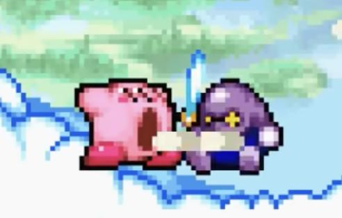
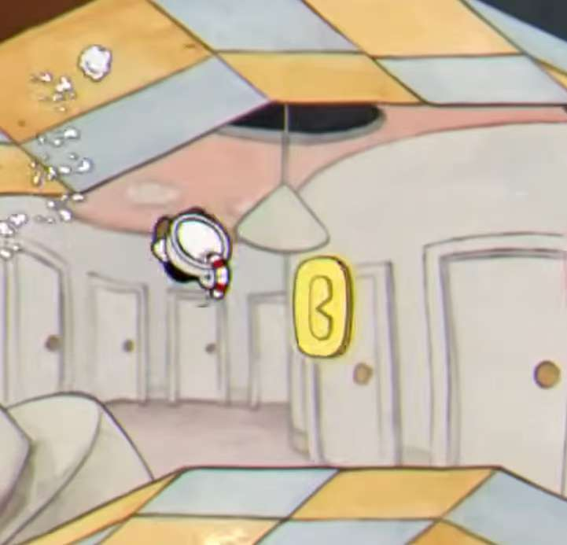
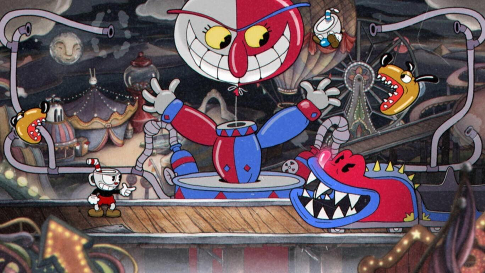
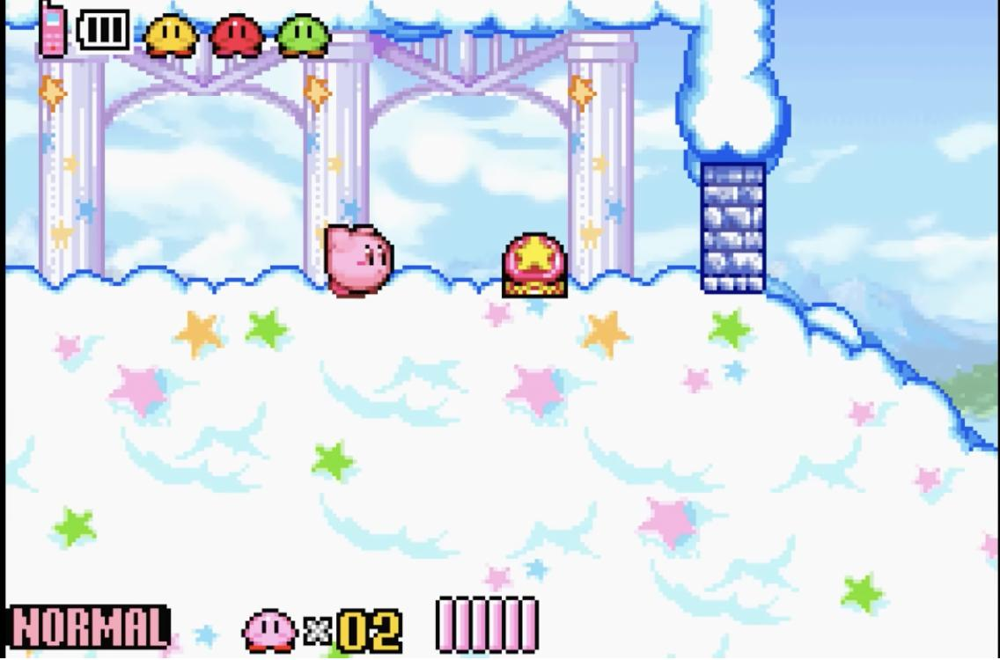
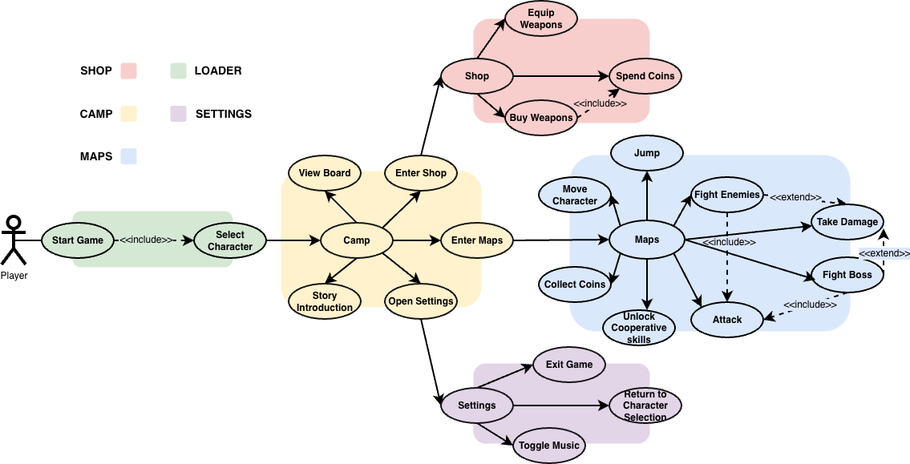

# 2026-group-22
2026 COMSM0166 group 22
# COMSM0166 Project Template
A project template for the Software Engineering Discipline and Practice module (COMSM0166).

<a href="https://uob-comsm0166.github.io/2026-group-22/">Click here to play the game</a>

## Info

This is the template for your group project repo/report. We'll be setting up your repo and assigning you to it after the group forming activity. You can delete this info section, but please keep the rest of the repo structure intact.

You will be developing your game using [P5.js](https://p5js.org) a javascript library that provides you will all the tools you need to make your game. However, we won't be teaching you javascript, this is a chance for you and your team to learn a (friendly) new language and framework quickly, something you will almost certainly have to do with your summer project and in future. There is a lot of documentation online, you can start with:

- [P5.js tutorials](https://p5js.org/tutorials/) 
- [Coding Train P5.js](https://thecodingtrain.com/tracks/code-programming-with-p5-js) course - go here for enthusiastic video tutorials from Dan Shiffman (recommended!)

## Your Game (change to title of your game)

STRAPLINE. Add an exciting one sentence description of your game here.

IMAGE. Add an image of your game here, keep this updated with a snapshot of your latest development.

LINK. Add a link here to your deployed game, you can also make the image above link to your game if you wish. Your game lives in the [/docs](/docs) folder, and is published using Github pages. 

VIDEO. Include a demo video of your game here (you don't have to wait until the end, you can insert a work in progress video)

<b><h2>Table of Contents</h2></b>

- [2026-group-22](#2026-group-22)
- [COMSM0166 Project Template](#comsm0166-project-template)
  - [Info](#info)
  - [Your Game (change to title of your game)](#your-game-change-to-title-of-your-game)
  - [Your Group](#your-group)
  - [Project Report](#project-report)
    - [Introduction](#introduction)
      - [Descripe your game](#descripe-your-game)
      - [what is based on](#what-is-based-on)
      - [what makes it novel](#what-makes-it-novel)
    - [Requirements](#requirements)
      - [Early Stages Design](#early-stages-design)
        - [KirbyHead Paper Prototype](#kirbyhead-paper-prototype)
      - [Ideation Process](#ideation-process)
      - [Identifying Stakeholder](#identifying-stakeholder)
      - [User Stories](#user-stories)
      - [Use Case Diagrams and Specifications](#use-case-diagrams-and-specifications)
        - [Use Case Descriptions (Game Flows)](#use-case-descriptions-game-flows)
    - [Design](#design)
      - [System Architecture](#system-architecture)
        - [Scene Control and Persistent Game State](#scene-control-and-persistent-game-state)
        - [Gameplay World Simulation](#gameplay-world-simulation)
        - [Reusable Objects and Supporting Manager Systems](#reusable-objects-and-supporting-manager-systems)
    - [Implementation](#implementation)
      - [Challenge 1: Alignment of Hitbox Design and Visual Presentation](#challenge-1-alignment-of-hitbox-design-and-visual-presentation)
        - [Challenge:](#challenge)
        - [Solution:](#solution)
      - [Challenge 2: Physics Collision Detection and Positional Correction in 2D Platformers](#challenge-2-physics-collision-detection-and-positional-correction-in-2d-platformers)
        - [Challenge:](#challenge-1)
        - [Solution:](#solution-1)
    - [Evaluation](#evaluation)
      - [1 Qualitative Evaluation](#1-qualitative-evaluation)
        - [1.1 Study Design and Participant Recruitment](#11-study-design-and-participant-recruitment)
        - [1.2 Main Feedback Themes](#12-main-feedback-themes)
          - [1.2.1 Player Movement and Operational Feel](#121-player-movement-and-operational-feel)
          - [1.2.2 Level Difficulty and Challenge](#122-level-difficulty-and-challenge)
          - [1.2.3 Game Guidance and Information Presentation](#123-game-guidance-and-information-presentation)
          - [1.2.4 Level Layout and Environmental Design](#124-level-layout-and-environmental-design)
          - [1.2.5 Enemy Design and Item Usage](#125-enemy-design-and-item-usage)
          - [1.2.6 Game Pacing and Sound Feedback](#126-game-pacing-and-sound-feedback)
        - [1.3 Summary and Outlook](#13-summary-and-outlook)
      - [2 Quantitative Evaluation](#2-quantitative-evaluation)
        - [2.1 Study Design and Participant Demographics](#21-study-design-and-participant-demographics)
        - [2.2 System Usability Scale (SUS) Assessment](#22-system-usability-scale-sus-assessment)
        - [2.3 Cognitive Load Assessment (NASA-TLX)](#23-cognitive-load-assessment-nasa-tlx)
        - [2.4 Subjective Level Difficulty Ranking](#24-subjective-level-difficulty-ranking)
        - [2.5 Correlation Between SUS and NASA-TLX Scores](#25-correlation-between-sus-and-nasa-tlx-scores)
      - [Testing](#testing)
        - [Black Box Testing](#black-box-testing)
          - [1. Equivalence Partitioning and Input Validation](#1-equivalence-partitioning-and-input-validation)
          - [2. Functional Testing:](#2-functional-testing)
          - [3. Boundary Testing:](#3-boundary-testing)
          - [4. Performance Testing:](#4-performance-testing)
        - [White Box Testing](#white-box-testing)
          - [1. Code Coverage:](#1-code-coverage)
          - [2. Path Testing:](#2-path-testing)
          - [3. Unit Testing:](#3-unit-testing)
          - [4. Memory and Static Analysis:](#4-memory-and-static-analysis)
    - [Process](#process)
      - [TeamWork: Project Stages and Task Allocation](#teamwork-project-stages-and-task-allocation)
      - [TeamWork: Communication and Collaboration](#teamwork-communication-and-collaboration)
      - [Method and Tools](#method-and-tools)
      - [Outcome](#outcome)
    - [Sustainability, Ethics, and Accessibility](#sustainability-ethics-and-accessibility)
      - [Environmental Sustainability](#environmental-sustainability)
      - [Technical Sustainability](#technical-sustainability)
      - [Social Sustainability](#social-sustainability)
      - [Green Software Foundation Implementation Patterns](#green-software-foundation-implementation-patterns)
    - [Conclusion](#conclusion)
      - [Reflect on the project as a whole](#reflect-on-the-project-as-a-whole)
      - [Reflect on challenges \& Lessons learnt](#reflect-on-challenges--lessons-learnt)
        - [Reflect on challenges](#reflect-on-challenges)
        - [Lessons Learnt](#lessons-learnt)
        - [Future work](#future-work)
    - [Contribution Statement](#contribution-statement)

## Your Group

| Name | Email | Github | Role |
| -- | -- | -- | -- |
| Jiahao Zhao | uw25968@bristol.ac.uk | @zhaojiahao296 | role |
| Shalakorn Teerasukaporn | eu25930@bristol.ac.uk | @markslk | role |
| Mingyu Yang | ak25461@bristol.ac.uk | @mingyuyang0804 | role |
| Qing Shi | rp25678@bristol.ac.uk | @qqq033370 | role |
| Xinyi Zhang | ya25475@bristol.ac.uk | @nikanotaku | role |

## Project Report

### Introduction

#### Descripe your game 
Isle of Rising Sun is a platform jumping game where players navigate through four levels of increasing difficulty to successfully complete the challenge. 

#### what is based on
Its main inspiration comes from Kirby the Star and the teacup head. The core of the game is that within each level, players can control their characters to cross various platforms, collaborate with special allies to overcome obstacles, use different weapons to defeat various unique monsters, and use the coins collected along the way to purchase other weapons.

#### what makes it novel

After making a final decision on our baseline games, we came up with the ideas for our game mechanics and game twists which are as follows.

Game Twists
We mainly built the twist of our game based on Kirby and Cuphead：

- Two skills-acquiring system, including cooperation with friends and obtaining skills in store by collecting gold coins.

  

  

- Two types of characters (enemies and friends).

  

- Series of blocks of maps

  

  

Game Mechanics
The core mechanics combine linear, block based progression with a two channel skill acquisition system and coin driven shop decisions. After selecting a mode and character, the player enters a stage composed of sequential map blocks where progression is forward only with no backtracking. While advancing, players earn coins through combat and exploration, but crucially, skills can be obtained in two ways: 
(1) in level cooperation with allies, where coordinated interactions or synergy actions directly unlock or upgrade abilities during the run; and 
(2) a purchase period in store after each block, where coins are spent to buy skills or acquire and integrate ally abilities. As stages progress, enemies introduce distinct requirements and vulnerabilities, so players must strategically balance what they gain on the road via cooperation versus what they complete or optimize in the shop.

This creates a repeatable loop: advance → earn coins / gain skills through cooperation → shop upgrades → adapt to the next block’s mechanics → advance.

### Requirements 

#### Early Stages Design 
Initial Paper Prototype of Our Game 
	
We made a first paper prototype of our game which we initially named it, KirbyHead, based on game twists and mechanics we discussed earlier to see a clear picture of our game functionalities which can lead to a solid development foundation of the game’s codebase

##### KirbyHead Paper Prototype 

    

Click the banner above to watch the video

The video above shows the initial prototype of our game, KirbyHead, which is the combination of Kirby & the Amazing Mirror and Cuphead. This game implements the core mechanics of both games, including the ability of Kirby to inhale objects and the ability of cuphead to attack enemies by firing bullets. Aside from the mix between the two, we've also added a special twist to the game in the form of various types of allies. By inhaling allies, the main character can temporarily inherit their special abilities.

#### Ideation Process
In the end, we decided that we are going to make our games based on game mechanics and styles of both Kirby & The Amazing Mirror and Cuphead.

  

Kirby is a colorful platformer where you control Kirby through side scrolling or 3D stages, jumping, floating, and fighting enemies. The core mechanic is Kirby’s ability to inhale foes and objects, then copy enemy powers to gain new attacks and movement options. Levels focus on simple combat, exploration, and light puzzles, with power ups encouraging flexible, playful playstyles.

  

Cuphead is a run-and-gun boss-rush action game with a 1930s cartoon aesthetic, built around fast, pattern heavy fights. You shoot, dodge, dash, and parry to build special attacks while learning enemy telegraphs and phases. The gameplay emphasizes tight controls, memorization, and precision, with short stages and bosses designed for repeated attempts and mastery.

#### Identifying Stakeholder

  

#### User Stories
Epic 1: Core Platforming Mechanics
Epic 2: Ability-Merging System
Epic 3: Currency & Progression System
Epic 4: Art & User Experience

| Epic | User Story | Acceptance Criteria | Value | Effort | MoSCoW |
| :--- | :--- | :--- | :---: | :---: | :---: |
| **Epic 1: Core Platforming Mechanics** | **Casual Player:** As a casual player, I want smooth movement controls, so that I can enjoy the game without frustration. | • Movement triggers within 100ms   • Character stops/decelerates smoothly   • No noticeable input lag | High | Low | **Must Have** |
| **Epic 1: Core Platforming Mechanics** | **Skilled Player:** As a competitive player, I want tight collision detection, so that my performance reflects skill. | • Accurate landing without slipping   • Instant damage registration   • No clipping or falling through surfaces | High | High | Should Have |
| **Epic 2: Ability-Merging System** | **Exploration Player:** As an exploration player, I want to merge with items to experiment with new abilities. | • Successful activation of merged form   • New abilities available immediately   • Clear in-game tutorial for new abilities | High | High | Should Have |
| **Epic 2: Ability-Merging System** | **Curious Player:** As a curious player, I want clear feedback when abilities combine, so I understand my new power. | • Distinct visual effect for merging   • Ability icon/name displayed in UI   • Unique animation and sound effects | High | Low | **Must Have** |
| **Epic 2: Ability-Merging System** | **Strategic Team:** As a development team, I want varied effectiveness for abilities, so players can plan their approach. | • Choices influence level approach   • Multiple viable ways to solve challenges   • Ability to adapt without forced solutions | High | High | Should Have |
| **Epic 3: Currency & Progression** | **Progression Player:** As a progression player, I want to collect currency, so that I feel a sense of advancement. | • Immediate update of currency counter   • Sound and visual feedback on pickup   • Data persisted after exiting level | High | Low | **Must Have** |
| **Epic 3: Currency & Progression** | **Progress-Security:** As a player, I want my game progress to be reliably saved, so I do not lose achievements. | • Successful save without data loss   • Accurate restoration on game load   • Auto-save after key milestones | High | Low | **Must Have** |
| **Epic 4: Art & UX** | **New Player:** As a new player, I want intuitive UI guidance, so I can understand mechanics without long tutorials. | • Contextual hints for new weapons   • Visual cues for interactive objects   • Hazards are visually distinct from platforms | High | Low | **Must Have** |
| **Epic 4: Art & UX** | **Immersion Designer:** As a designer, I want a consistent art style, so the game world feels cohesive. | • Consistent color, lighting, and design   • UI matches overall art direction   • No placeholder or unpolished assets visible | High | High | Should Have |

#### Use Case Diagrams and Specifications
This use case diagram illustrates the main interactions between the player and the game system. It presents the overall functional structure of the project, including the Loader, Camp, Maps, Shop, and Settings modules, as well as the relationships between core gameplay actions and supporting system features.

  

Figure x. Use-case diagram

The following table presents the use case specifications for the core functions of the game system. Developed from the use case diagram, it provides a more structured description of the main interactions between the player and the system. Each use case is organised into Basic Flow and Alternative Flow. The Basic Flow describes the standard sequence of actions under normal conditions, while the Alternative Flow outlines possible exceptions, failures, or conditional variations during the interaction process.

##### Use Case Descriptions (Game Flows)

| Feature / Action | Basic Flow (Success Path) | Alternative Flow (Exceptions) |
| :--- | :--- | :--- |
| **Start Game** | 1. Player launches game and selects **Start Game**   2. System moves to character selection   3. Player selects character and enters **Camp Scene** | If the player closes the game, the session ends. |
| **Enter Shop** | 1. Player selects **Enter Shop**   2. System opens shop interface   3. Available weapons are displayed | If the shop fails to load, the player is returned to the camp. |
| **Buy Weapons** | 1. Player selects a weapon   2. System checks balance and deducts coins   3. Weapon is added to inventory | 1. Insufficient coins: Purchase is rejected   2. Player cancels: No transaction is completed |
| **Enter Maps** | 1. Player selects **Enter Maps** and enters gameplay area   2. Player can move, jump, fight, and use skills | If the map fails to load, the system returns the player to the camp. |
| **Open Settings** | 1. Player selects **Open Settings**   2. Adjust music, return to selection, or exit game | 1. Close menu: Return to camp   2. No option selected: No changes saved |

### Design

#### System Architecture
Our game uses a scene based and object oriented architecture built on top of p5.js. The main structure is divided into scene control, persistent game state, gameplay world simulation, reusable game objects, and supporting manager systems. This separation keeps the main sketch simple and makes the code easier to extend and debug.

##### Scene Control and Persistent Game State
The scene control and persistent game state are handled separately from the main gameplay logic. The p5.js entry file, sketch.js, only initializes the loading scene, preloads assets, and delegates core events such as draw(), mousePressed(), keyPressed(), and windowResized() to sceneManager. Screen flow is then controlled by SceneManager.js, which stores and switches between scenes such as TitleScene, CharSelectScene, DiffSelectScene, CampScene, ShopScene, LevelScene, and BossScene. Long-term progress is managed by GameState.js, which stores coins, owned items, equipped weapons, difficulty, unlocked levels, and settings through local storage.

##### Gameplay World Simulation
The gameplay world simulation is mainly handled by LevelScene.js, World.js, and LevelBuilder.js. When a level starts, LevelScene.js creates the player and builds a World object for the selected level. World.js then manages the player, enemies, platforms, collectables, checkpoints, projectiles, camera movement, collision checks, and UI updates. Level construction is data driven: LevelBuilder.js reads level configuration data and converts it into concrete game objects such as platforms, enemies, coins, checkpoints, and items.

##### Reusable Objects and Supporting Manager Systems
The reusable game objects and supporting manager systems are handled by a set of base classes and manager classes. GameObject.js provides shared position, size, active state, bounds, and collision methods, while Entity.js adds health, speed, velocity, gravity, physics, and damage handling. More specific classes such as Player, Enemy, Boss, Platform, Collectable, and Projectile extend these base structures to create different behaviours. Supporting systems such as AssetManager, AnimationManager, AbilityManager, and InteractionManager handle asset loading, sprite animation, player abilities, combat, projectiles, puzzles, and world limits.
 
Overall, this architecture separates screen flow, game progress, level simulation, object behaviour, and shared support systems into different parts of the codebase. During the development process, this made the game easier to maintain, debug, and divide among team members because each file had a clear responsibility. In the longer term, it also provides a more scalable structure for future development, content updates, and long-term maintenance as a complete game project.

### Implementation

To ensure high scalability, we implemented a strict modular architecture divided into three independent layers following Object Oriented Design (OOD) approach:
1. UI Layer : Interfaces are abstracted into independent scenes (e.g.,CampScene.js) with onEnter/onExit hooks. sketch.js delegates native events (draw, mousePressed) to a singleton SceneManager, which routes them to the active scene, ensuring absolute UI state isolation.
2. Physics & Logic Layer : A base GameObject class standardizes rendering and boundaries, from which entities like Player, Enemy, and Platform are derived. The World.js container simply calls update() and show() polymorphically on child objects within the frame loop.
3. Data Layer : Level assets (terrain, items, backgrounds) are completely decoupled from logic into pure configuration files (src/levels/LevelX.js). World.js acts as a parser, dynamically instantiating the world based on the level index to separate code from game assets.

During implementation, we primarily faced and solved two technical challenges:

#### Challenge 1: Alignment of Hitbox Design and Visual Presentation
##### Challenge:
Utilizing the raw dimensions of game sprites for collision detection often results in poor "game feel." Due to transparent margins in many image assets, hitboxes that perfectly match image sizes can lead to "unfair" outcomes—such as players taking damage before visual contact is made or falling off platforms while their character's feet still appear to be on the edge. Furthermore, the vast scale difference between massive bosses and small projectiles necessitates a flexible boundary logic; a rigid, uniform approach would create a noticeable disconnect between visual cues and physical reality.
##### Solution:
To ensure physical detection aligns with player intuition, a "Visual-Physical Decoupling" strategy was implemented:

- Standardization of Boundary Calculations: A universal getBounds() method was established within the GameObject.js base class. This method calculates boundaries based on manually defined width (w) and height (h) properties rather than raw sprite dimensions, ensuring a consistent and efficient detection standard across the entire project.

- Implementation of Forgiving Hitboxes: To optimize the user experience, physical hitboxes for players and enemies are calibrated to be slightly smaller than their corresponding visual assets. This design ensures that collisions are only registered when visually undeniable, thereby increasing the margin for error and reducing player frustration.

- Decoupling of Render and Physical Dimensions: For large-scale entities like bosses, the system distinguishes between visual dimensions (visualW/H) and physical collision dimensions (w/h). By leveraging alignment settings within the AnimationManager, precise positioning (such as grounding a boss’s feet) is maintained, preventing hitbox misalignment caused by animation scaling.

- argeted Boundary Extension for Special Objects: For unique elements such as the ChainPlatform, the boundary retrieval method is overridden to allow the detection zone to extend upward under specific states. This facilitates accurate interaction across the entire length of the chain without the need for redundant or complex code.

#### Challenge 2: Physics Collision Detection and Positional Correction in 2D Platformers
##### Challenge:
One of the most complex aspects of developing a platformer is precisely determining whether a character has "landed on a platform," "hit a side wall," or "collided with the ceiling." Relying solely on basic rectangular overlap detection often leads to erratic physics logic: characters may become stuck inside blocks (clipping) or bypass floors entirely due to high falling speeds (tunneling). Additionally, ensuring a character remains securely on a moving platform without sliding off is a significant challenge in maintaining a polished "game feel."

##### Solution:
To resolve these physical inaccuracies and unnatural movements, a coordinate correction logic was integrated into the resolve collision handling mechanism within Platform.js:

- Directional Collision Differentiation: The system moves beyond simple collision detection by utilizing a getOverlap method to calculate the depth of overlap across all four directions. By comparing these values, the program accurately distinguishes whether the character is falling from above or impacting from the side or bottom.

- Landing Detection and Positional "Snapping": When a top-down collision is detected, Positional Correction is automatically executed. The character's Y-coordinate is immediately aligned to the top of the platform (p.top - entity.h / 2), and vertical velocity is neutralized. This triggers the land() function to reset jump counts, ensuring the character stands firmly on the surface without visual sinking artifacts.

- Mitigation of Clipping and Tunneling: For non-landing collisions (sides or bottom), the system identifies the axis of minimum overlap and "pushes" the character out in that direction. This ensures that even at high speeds, the character is instantly repositioned outside the collision volume, effectively preventing them from becoming stuck inside walls.

- Velocity Synchronization for Moving Platforms: Within the resolve method, the moving platform’s own velocity (velX and velY) is transferred in real-time to the character currently standing on it. This ensures the character moves in perfect synchronization with the platform, providing a stable and responsive control experience.

### Evaluation

#### 1 Qualitative Evaluation
To gain an in-depth understanding of players’ genuine experiences regarding level design, game difficulty, operational feel, and the overall game concept, we adopted the Think Aloud technique. This method allows us to capture players’ immediate reactions and thoughts during gameplay, helping us identify design strengths and weaknesses while providing strong evidence for subsequent iterations.

##### 1.1 Study Design and Participant Recruitment
We recruited 14 participants from diverse backgrounds to ensure broad and varied feedback. Their gaming experience ranged from absolute beginners to hardcore players. During the experiment, participants played through all 4 levels in both Easy and Hard modes. Players continuously verbalized their operational strategies, immediate impressions, and feedback regarding level layout, enemy design, item functions, visual effects, and sound effects. After data collection, we organized and coded the textual data to extract the core feedback themes.

##### 1.2 Main Feedback Themes
###### 1.2.1 Player Movement and Operational Feel
Immediate Feedback: The majority of players praised the core movement mechanics, describing the controls as simple, responsive, and easy to pick up, with a nostalgic feel reminiscent of classic games.
Areas for Improvement: Some players noted minor issues, such as the character falling too slowly after a jump and slight input delays. Additionally, players suggested that the transition animations between turning, jumping, and attacking could be smoother to enhance the overall operational feel.

###### 1.2.2 Level Difficulty and Challenge
Difficulty Balance: Players generally agreed that the Easy mode is highly accessible and beginner-friendly, while the level design hits a "sweet spot" where jumps require skill without feeling unfair.
Combat and Bug Reports: A common critique was that enemy and boss HP (especially the Hard mode boss and Easy mode regular enemies) felt too high, making combat tedious. Players also discovered exploits, such as bosses having attack blind spots at the edges of the map. Furthermore, critical bugs were reported, including broken save points and players being able to continue fighting with zero health.

###### 1.2.3 Game Guidance and Information Presentation
Tutorial Clarity: While the basic tutorials were straightforward, many players felt the in-game guidance was insufficient. The tutorial text was often described as unclear or easily overlooked.
Missing Instructions: Participants frequently mentioned confusion regarding core mechanics: the double jump, specific item usages (like the bow in Level 4), and the death penalty (being sent back to the start). Most notably, the checkpoint system (the purple gem) was heavily misunderstood, with many players mistaking it for a collectible item rather than a save point. Players also requested visual highlights for interactive UI elements (like the shop) and noted the absence of a victory screen after defeating bosses.

###### 1.2.4 Level Layout and Environmental Design
Visual and Thematic Performance: The environmental design was highly praised. Players appreciated the clear structure and distinct themes across the 4 levels, noting that each map had unique mechanics and avoided feeling homogenized.
Interaction Suggestions: To elevate the experience, several participants suggested increasing the interactivity of the environments. Instead of the environment serving solely as a background, players recommended adding interactive elements like stackable wooden crates to assist with platforming, which would deepen gameplay engagement.

###### 1.2.5 Enemy Design and Item Usage
Enemy Behavior: While the classic enemy setup was appreciated, many players found the enemy AI to be overly basic and monotonous. Participants suggested adding ranged attack modes to regular enemies and refining boss mechanics (e.g., providing hints to dodge the Level 1 boss's bullets). The Level 4 boss was specifically called out for having unfinished graphics and poor design.
Item Functionality: Although players found the map-specific items interesting, they felt the overarching item pool lacked originality. Clearer instructions upon picking up new items are necessary to improve strategic usage.

###### 1.2.6 Game Pacing and Sound Feedback
Pacing Control: The overall game pacing was well-received, with players noting that the 2-3 minute duration per map felt excellent and comfortable.
Sensory Feedback: Feedback regarding the audio was mixed; some found the audio generic and failing to amplify the emotional experience. To increase the “satisfaction” of the combat, players highly recommended adding distinct visual and audio feedback for key actions, such as critical hits and perfect dodges.

##### 1.3 Summary and Outlook
Through this qualitative evaluation, we have gathered invaluable insights into player movement, difficulty balancing, tutorial clarity, and overall game mechanics. The feedback indicates that while the game has a strong, nostalgic foundation with well-structured levels and accessible controls, there are critical areas requiring immediate attention. Moving forward, our primary focus will be on refining game guidance (especially regarding checkpoints and item usage), balancing enemy HP, fixing game-breaking bugs, and enhancing the audiovisual feedback for combat actions. By addressing these pain points and introducing more dynamic enemy AI and environmental interactions, our continuous iterative refinement aims to create a more polished, engaging, and rewarding experience for players of all skill levels.

#### 2 Quantitative Evaluation
To complement the qualitative feedback and gain objective, measurable insights into the player experience of Island of Rising Sun, we conducted a comprehensive quantitative evaluation.

##### 2.1 Study Design and Participant Demographics
We recruited 22 participants with varying degrees of platformer experience. Each participant was required to complete all four levels of the game under two distinct conditions: Easy Mode and Difficult (Hard) Mode. This within-subjects design yielded a total of 44 valid questionnaires.
The survey was designed to measure four core dimensions: Basic player information, System Usability Scale (SUS) for overall usability, NASA Task Load Index (NASA-TLX) for perceived cognitive and physical load, and subjective difficulty rankings across the four levels.
Demographics: Male (54.5%), Female (45.5%).
Gaming Experience: Novice (27.3%), Casual (45.4%), Hardcore/Experienced in platformers (27.3%).

  

Figure 1: Distribution of participants' prior gaming experience.

##### 2.2 System Usability Scale (SUS) Assessment

The SUS is a highly reliable tool for evaluating the usability of a system. A score above 68 is generally considered above average.

**Table 1: System Usability Scale (SUS) results by game mode.**

| Mode | Average SUS Score | Usability Grade | Player Interpretation |
| :--- | :--- | :--- | :--- |
| **Easy Mode** | 82.5 | A | "Excellent. Controls (jumping, buying weapons) are highly intuitive." |
| **Difficult Mode** | 71.2 | C+ | "Good, but the tight jump windows and unforgiving enemy mechanics caused slight frustration." |

The results indicate that Island of Rising Sun has a strong foundational UI and control scheme. However, the drop in the Difficult mode suggests that when players are under pressure (e.g., dodging bosses while trying to collect coins), the interface and control responsiveness are perceived as slightly less forgiving.

  

Figure 2: Comparison of average SUS scores between Easy and Difficult modes.

##### 2.3 Cognitive Load Assessment (NASA-TLX)
We utilized the NASA-TLX to assess the workload placed on players. It measures six dimensions on a scale of 0 (Very Low) to 100 (Very High).

**Table 2: NASA-TLX subscale scores across modes.**

| Dimension | Easy Mode (Mean) | Difficult Mode (Mean) | Difference |
| :--- | :---: | :---: | :---: |
| Mental Demand | 35.4 | 68.2 | + 32.8 |
| Physical Demand | 42.1 | 75.5 | + 33.4 |
| Temporal Demand | 30.5 | 65.0 | + 34.5 |
| Performance (Inverted)* | 25.0 | 55.4 | + 30.4 |
| Effort | 40.2 | 82.3 | + 42.1 |
| Frustration | 15.6 | 60.8 | + 45.2 |

*\*Note: Lower performance score means the player felt less successful.*

Analysis: The data reflects the core mechanics of Island of Rising Sun. In Difficult mode, the demand for precise platform jumping and strategic resource management (collecting coins to buy specific weapons in the shop) significantly increased Physical Demand and Effort. The sharpest increase was in Frustration (+45.2), aligning with the qualitative feedback regarding the unforgiving nature of the Hard mode bosses.

  

Figure 3: Radar chart visualizing the cognitive and physical load in different modes.

##### 2.4 Subjective Level Difficulty Ranking
Participants ranked the subjective difficulty of the 4 levels on a scale of 1 (Easiest) to 10 (Hardest).

**Table 3: Subjective difficulty ratings for Levels 1 to 4.**

| Level | Easy Mode Score | Difficult Mode Score |
| :--- | :---: | :---: |
| Level 1 | 2.1 | 4.5 |
| Level 2 | 3.5 | 6.2 |
| Level 3 | 4.8 | 8.1 |
| Level 4 | 6.0 | 9.5 |

Analysis: The progression curve is highly logical. Both modes show a linear increase in difficulty, proving that our level design effectively scales up the challenge. However, Level 4 in Difficult Mode (9.5/10) verges on being overly punitive, indicating a potential need for minor balancing adjustments to boss health or weapon damage scaling.

  

Figure 4: Subjective difficulty progression across the four levels.

##### 2.5 Correlation Between SUS and NASA-TLX Scores
To understand how game difficulty impacts the player's perception of the game's usability, we conducted a Pearson correlation analysis between the total SUS scores and the overall NASA-TLX workload scores across all 44 questionnaires.
Result: There is a significant negative correlation (Pearson's r = -0.68, p < 0.01) between SUS and NASA-TLX scores.
Conclusion: As the cognitive and physical load increases (higher NASA-TLX), players' rating of the system's usability decreases (lower SUS). This is a critical insight for Island of Rising Sun. It suggests that players are conflating "gameplay difficulty" (e.g., hard-to-kill mobs) with "system usability" (e.g., jumping mechanics). To improve future iterations, we must ensure that when the game gets harder, the controls remain flawlessly responsive, so players blame their own timing rather than the game's operational feel.

  

Figure 5: Scatter plot showing the negative correlation between NASA-TLX workload and SUS scores.

#### Testing

To ensure the stability of the platforming mechanics, the integrity of the game’s economy, and the robustness of the underlying architecture, a comprehensive testing workflow encompassing both Black-Box and White-Box testing methodologies was implemented:

##### Black Box Testing
###### 1. Equivalence Partitioning and Input Validation
Rigorous testing was conducted on the input system (A/D for movement, SPACE for jumping).   It was verified that movement remains fluid and that character animations (idle, run, jump) synchronize correctly with the physics engine.   Furthermore, combat inputs using the J (Shoot) key were validated for projectile trajectory.   Additionally, the ESC key was tested to ensure it reliably triggers the "Camp" (menu/pause) state without disrupting the game loop.

###### 2. Functional Testing:
Hitboxes for both melee and ranged attacks were refined for accuracy, ensuring that enemy health points (HP) decrement correctly upon impact.   The K (Collect) mechanic was tested to ensure coins are properly added to the player's balance.   We also verified that items are correctly equipped after a successful transaction in the Shop System.   Specific integration tests were conducted for the final Boss encounter to check AI behavior patterns and ensure the game correctly transitions to a "Win" state upon the Boss's defeat.

###### 3. Boundary Testing: 
Limit testing was performed on the Shop System to verify that players cannot purchase weapons without sufficient funds.   Verification was also performed on the platform boundaries to ensure the player character remains within the defined world limits and triggers the respawn logic correctly if falling out of bounds.

###### 4. Performance Testing: 
The game's performance was monitored via browser developer tools to ensure a stable 60 FPS on Chrome and Firefox during high-intensity sequences.

##### White Box Testing
###### 1. Code Coverage: 
Test cases were designed to achieve high branch coverage, particularly in critical game logic such as AbilityManager.handleInput().   Tests ensured all if-else branches were executed, including the specific conditions for character states (isInhaling, isCharging) and verifying that both true and false evaluations of cooldown timers correctly trigger or restrict actions like fireBullet() and fireArrow().

###### 2. Path Testing:
We analyzed and validated the logical execution paths within the engine, notably in InteractionManager.handleCombat().   We tested the specific path where a player's projectile intersects with an enemy (bullet.intersects(enemy) evaluates to true), verifying the exact execution sequence: enemy.takeDamage() is called, and the bullet.  active flag is subsequently set to false to prevent multiple hit registrations.

###### 3. Unit Testing: 
Core classes and utility functions were subjected to strict assertion testing.   We specifically unit tested the GameState class to ensure purchaseItem(itemId) properly checks for this.  isOwned(itemId) and this.  coins < item.  price before deducting funds and updating the ownedItemIds array.   Similarly, Player.takeDamage() was tested to guarantee HP calculations correctly account for the invincibilityTimer to prevent instant death from overlapping frames.

###### 4. Memory and Static Analysis: 
Static analysis tools were utilized to check for undefined variables and ensure proper object instantiation across parent-child structures like GameObject and Entity.   Additionally, memory profiling was conducted to prevent memory leaks during gameplay loops.   We verified that the array filtering mechanisms in World.update() (e.g., this.enemies.filter(e => e.active)) successfully release references to dead enemies, off-screen minion bullets, and collected coins, allowing the JavaScript garbage collector to free up memory efficiently.

### Process 

#### TeamWork: Project Stages and Task Allocation
To manage the project effectively, we divided the development process into four main stages. Firstly, we conducted game research and defined the twist of the game, so that the project would have a clear gameplay direction from the beginning. Secondly, we confirmed the storyline, built the overall object-oriented programming framework, and developed the core logic and interaction of the main interfaces, while also deciding the key functional modules and the visual style. Thirdly, we refined the detailed gameplay features by improving the platform layouts of each map, completing the interactions and transitions between different pages, and integrating visual assets into the game. Finally, we focused on testing, debugging, and polishing the game, while also preparing the repository materials and final report documentation.

  

#### TeamWork: Communication and Collaboration
To maintain effective teamwork throughout the project, we combined both offline and online communication methods. Team members discussed design ideas, gameplay adjustments, and implementation details through face-to-face meetings, which allowed us to exchange opinions more directly and make decisions more efficiently. In addition, we held a regular online meeting every Saturday afternoon to review weekly progress, report completed tasks, and coordinate the next stage of development. This online meeting also gave each member an opportunity to raise technical or design issues they had encountered during the week. To keep communication clear outside meetings, we used shared documents and a Kanban board to record task assignments, monitor development status, and update priorities when necessary. This combination of regular meetings and shared tools helped the team remain organised, transparent, and aligned throughout the project.

  

  

In terms of problem solving, our team adopted a collaborative and iterative approach. When a technical issue or design difficulty emerged, we first raised it during our regular meetings or in group discussions so that all members could contribute possible ideas and solutions. If the problem could not be resolved immediately, we would break it down into smaller parts, assign follow-up tasks, and continue investigating it individually before discussing it again in the next meeting. For programming-related issues, we also relied on shared code review, peer discussion, and repeated testing to identify the source of bugs and evaluate whether a solution was effective. In some cases, we adjusted our original plan after discovering that a certain feature was more complex than expected, which allowed us to focus on practical solutions instead of forcing unsuitable designs. This problem-solving process helped us respond to difficulties in a flexible way and ensured that development could continue steadily even when unexpected challenges appeared.

  

#### Method and Tools
We adopted an agile and iterative development method throughout the project. Since the game’s mechanics, interface, and accessibility features required continuous refinement, we developed the product in stages rather than following a fixed one-time plan. Regular reviews and adjustments allowed us to respond quickly to new ideas, technical issues, and user feedback. This method helped the team stay flexible and supported steady progress during development.

#### Outcome
Overall, this process created a clearer and more manageable workflow throughout the project. By combining stage-based planning, regular meetings, and shared collaboration tools, our team was able to coordinate tasks effectively, address problems in time, and incorporate feedback during development. As a result, we completed a more polished and playable final game, together with the required repository materials and report documentation.

### Sustainability, Ethics, and Accessibility

  

#### Environmental Sustainability
In software engineering practice, code quality directly impacts hardware energy consumption. Even a simple web-based game can lead to high CPU utilization if the logic is poorly designed, thereby increasing the power consumption of end-user devices. Consequently, several key optimizations were implemented to improve energy efficiency.

- Reducing Redundant Rendering Overhead: The program avoids recalculating texture tiling in every frame when handling terrain display. By using the createGraphics function in Platform.js to create an off-screen buffer, terrain textures are rendered once during object initialization. This design reduces the computational burden during runtime and lowers hardware heat and power consumption.

- Memory Management and Automatic Cleanup: The game involves a large number of projectiles and enemies; if inactive objects remain in memory, system performance degrades. A lifecycle system established through InteractionManager, combined with the update logic in World.js, automatically cleans up unused bullets and drops every second. This proactive management mechanism ensures efficient use of computational resources.

- Lightweight Handling of Visual Resources: When implementing parallax scrolling backgrounds in World.js, the project avoids using ultra-large images. Instead, a few lightweight textures are used in conjunction with mathematical modulo operations to achieve seamless looping. This approach not only speeds up loading but also reduces network energy consumption during data transmission.

#### Technical Sustainability

Technical sustainability focuses on code maintainability and scalability, ensuring that the project does not require major refactoring during subsequent development.

- Complete Separation of Logic and Data: The project organizes level layouts and enemy configurations into independent configuration files, such as Level1.js. The core engine, LevelBuilder.js, is solely responsible for reading and parsing this data. This design achieves decoupling between logic and assets, allowing for the rapid addition of new content without modifying the underlying physics code, thus effectively avoiding the accumulation of technical debt.

- Modular Architectural Division: Various functions of the system are divided into several autonomous managers. For example, AbilityManager specifically handles skill logic, while AssetManager centrally manages resource loading. This clear division of labor improves code reliability and ensures that maintenance or modification of a single module does not cause unpredictable interference with the overall system.

#### Social Sustainability
Software should demonstrate inclusivity and reflect the value of team collaboration.

- Inclusive Difficulty Design: Difficulty presets (Easy and Difficult modes) are included in constants.js and GameState.js. By adjusting the numerical balance in Easy mode, a wider group of players with different skill levels can fully experience the game, reflecting social inclusivity in design.

- Cultivation of Team Collaboration Experience: Managing versions through Git during the development process not only improved production efficiency but also ensured knowledge sharing within the team through modular division of labor. The practice of this collaborative model lays a foundation for participating in larger-scale software engineering projects in the future.

#### Green Software Foundation Implementation Patterns 
Here are the three patterns we used and why:
1. Minimize main thread work
- Category: Web
- Our Usage: We use this pattern to manage our frame rate (FPS).
- Why we used it: In sketch.js, the draw() function usually runs at full speed by default. However, in scenes like the TitleScene or SettingsScene, the visuals are mostly static. By using the SceneManager to switch scenes and reduce the main thread's workload when high performance isn't needed, we stop the CPU from looping unnecessarily. This saves battery and prevents the player's device from getting too hot.

2. Defer offscreen images
- Category: Web
- Our Usage: We applied this to our asset-loading mechanism.
- Why we used it: Our AssetManager handles a lot of files, but we don't force the browser to download everything at the very start. For example, Level 4 has a huge background that is 15,000 pixels wide. We use the buildLevel logic in LevelScene to only trigger the loading of levelAssets when the player actually starts that specific level. This "lazy loading" approach prevents a lot of unnecessary data transfer, which saves the player's data and reduces the carbon footprint of the servers.

3. Optimize average CPU utilization
- Category: Cloud (applied to client-side computing)
- Our Usage: We use "Entity Culling" logic to cut down on the calculations done every frame.
- Why we used it: Our maps are very long; Level 1 alone is 12,000 pixels wide. Normally, World.js would try to update every single enemy and item in the level simultaneously. By using the InteractionManager to prioritize objects near the player, we ensure the CPU only processes physics and AI for things currently on screen. This significantly lowers the average CPU usage, allowing the game to run smoothly on older hardware and extending the device's lifespan.

### Conclusion

#### Reflect on the project as a whole 

Isle of Rising Sun is a 2D platformer that blends a unique narrative background with innovative level mechanics. Looking back at the entire development cycle, this was not merely a process of building a game program from scratch, but a comprehensive exercise in team collaboration within a complex system architecture. We successfully refactored an initially bloated, tightly coupled monolithic codebase into a modern game framework. This evolution witnessed our complete transformation from early development confusion to the establishment of an efficient, modular workflow.

#### Reflect on challenges & Lessons learnt
##### Reflect on challenges
In the early stages of development, our team encountered several significant technical and organizational hurdles. Initially, a disparity in JavaScript engineering experience caused a severe bottleneck, as code production relied far too heavily on a single developer. This technical strain was compounded by a lack of systematic software development planning. Our project management was unstructured, resulting in fragmented meetings, poor forecasting of future tasks, and an absence of retrospective analysis. Furthermore, our initial approach to task allocation was inadequate; verbally discussed tasks were easily forgotten, difficult to track, and poorly granulated. This lack of organization blurred task boundaries, leading to task overload for certain members and threatening our overall project timeline with delays.

##### Lessons Learnt
To overcome these obstacles, we learned the critical importance of adopting industry-standard engineering and management frameworks. To break the coding bottleneck, we fully integrated the Git version control system. By establishing standardized commit conventions and an asynchronous collaboration workflow, we learned how to successfully distribute tasks in parallel, honing the team's ability to resolve merge conflicts and maintain a shared codebase. On the management front, we embraced Agile methodologies by instituting a weekly meeting system. We learned to utilize "Retrospectives" and "Sprints" to systematically monitor real-time progress, tackle technical hurdles, and maintain a steady development cadence before critical milestones. Finally, to resolve our tracking issues, we adopted Kanban management. By using shared documents to break down massive development goals into quantifiable, bite-sized items, we learned how to significantly enhance team transparency and establish clear task boundaries, effectively preventing future delays.

##### Future work
In the immediate future, we aim to deepen the core gameplay loop by introducing a more diverse weapon system and NPC allies with unique tactical abilities. Furthermore, we plan to design platforms with more complex interaction mechanics and implement multi-phase Boss battles. For a potential sequel, we would explore significant system-level breakthroughs. This includes implementing network synchronization to support a multiplayer co-op mode, and developing a highly flexible, visual Level Editor (UGC system). This editor would empower players to fully customize and share their own level designs, effectively handing the creative power over to the community.

### Contribution Statement

| Name | Contribution |
| :--- | :---: |
| Jiahao Zhao | 1.00 |
| Shalakorn Teerasukaporn | 1.00 |
| Mingyu Yang | 1.00 |
| Qing Shi | 1.00 |
| Xinyi Zhang | 1.00 |
