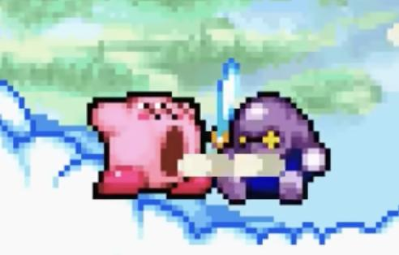
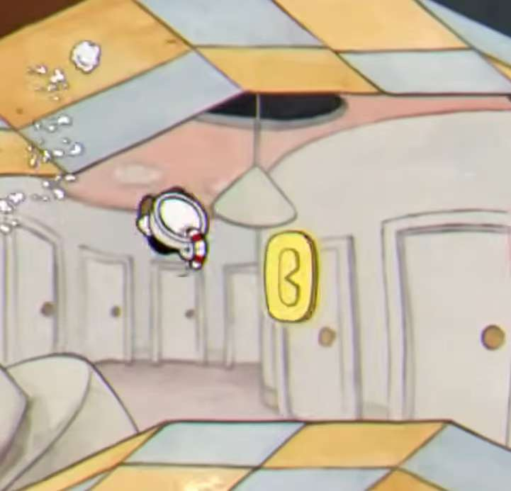
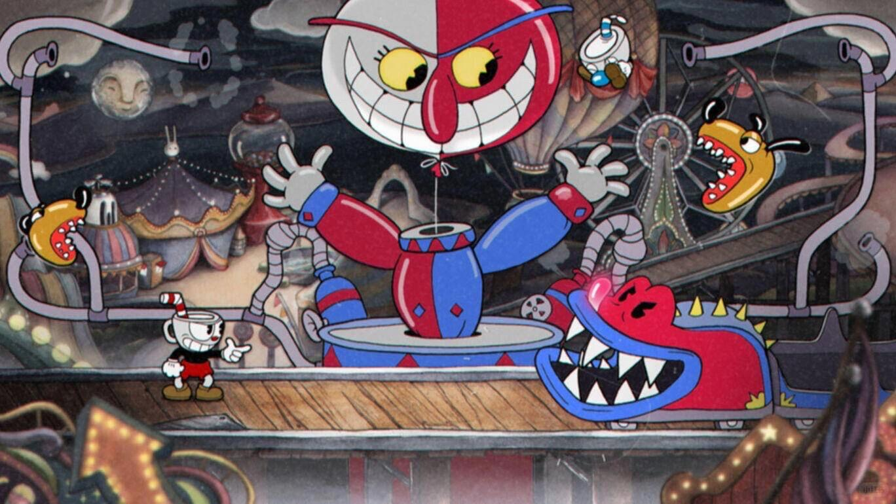
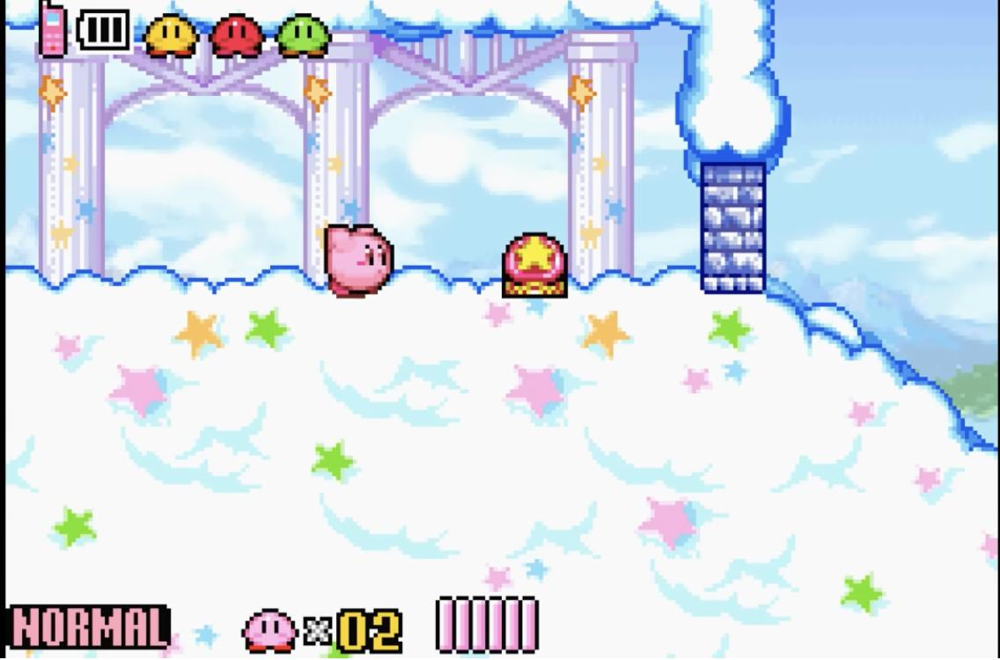
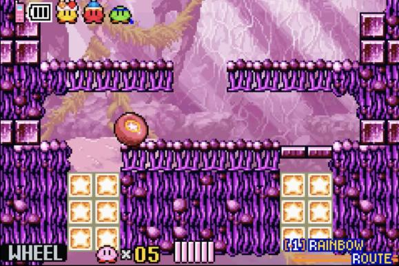
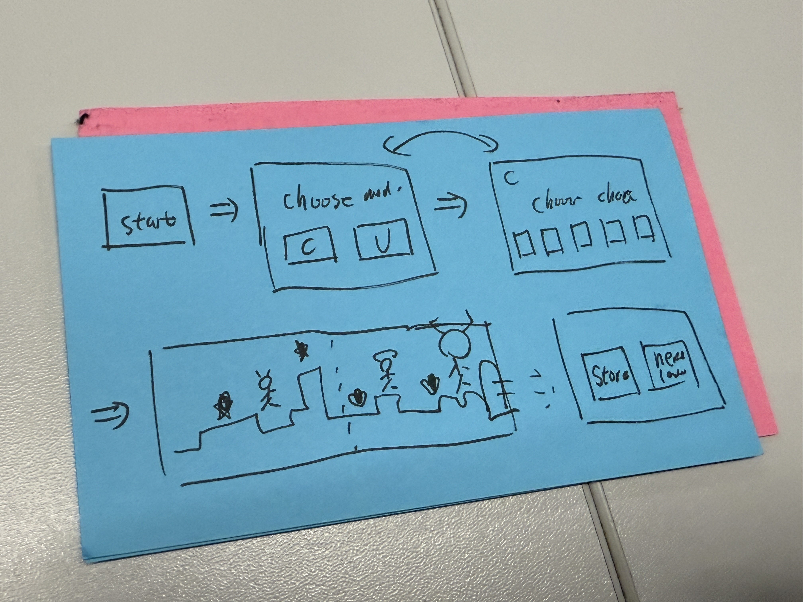
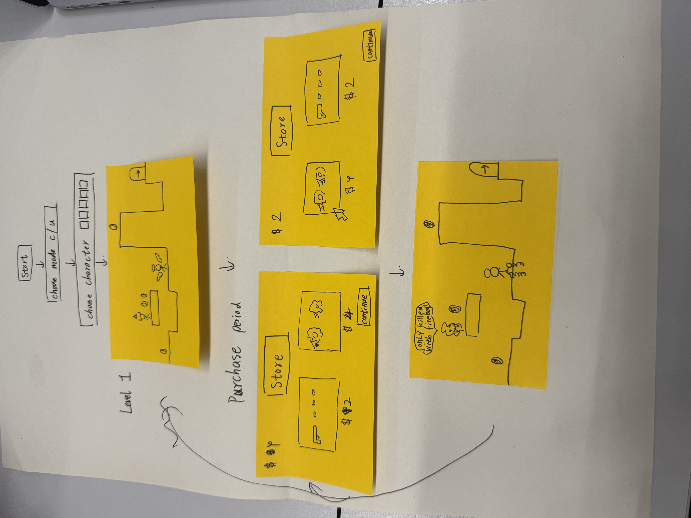

# Game Ideas

## Kirby and Cuphead

### Game Description

Kirby is a colorful platformer where you control Kirby through side scrolling or 3D stages, jumping, floating, and fighting enemies. The core mechanic is Kirby’s ability to inhale foes and objects, then copy enemy powers to gain new attacks and movement options. Levels focus on simple combat, exploration, and light puzzles, with power ups encouraging flexible, playful playstyles.

Cuphead is a run-and-gun boss-rush action game with a 1930s cartoon aesthetic, built around fast, pattern heavy fights. You shoot, dodge, dash, and parry to build special attacks while learning enemy telegraphs and phases. The gameplay emphasizes tight controls, memorization, and precision, with short stages and bosses designed for repeated attempts and mastery.

### Our Game Twist
We mainly built the twist of our game based on Kirby and Cuphead：

- Two skills-acquiring system, including cooperation with friends and obtaining skills in store by collecting gold coins.

     
    

- Two characters (enemies and friends)

    

- Series of blocks of maps

        

### Our Game Mechanics

The core mechanics combine linear, block based progression with a two channel skill acquisition system and coin driven shop decisions. After selecting a mode and character, the player enters a stage composed of sequential map blocks where progression is forward only with no backtracking. While advancing, players earn coins through combat and exploration, but crucially, skills can be obtained in two ways: (1) in level cooperation with allies, where coordinated interactions or synergy actions directly unlock or upgrade abilities during the run; and (2) a purchase period in store after each block, where coins are spent to buy skills or acquire and integrate ally abilities. As stages progress, enemies introduce distinct requirements and vulnerabilities, so players must strategically balance what they gain on the road via cooperation versus what they complete or optimize in the shop. 

This creates a repeatable loop: advance → earn coins / gain skills through cooperation → shop upgrades → adapt to the next block’s mechanics → advance.

    
    

