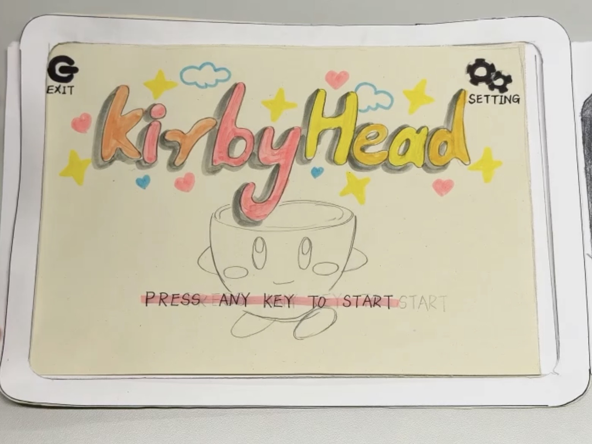

# KirbyHead Paper Prototype 

    

Click the banner above to watch the video

The video above shows the initial prototype of our game, KirbyHead, which is the combination of Kirby & the Amazing Mirror and Cuphead. This game implements the core mechanics of both games, including the ability of Kirby to inhale objects and the ability of cuphead to attack enemies by firing bullets. Aside from the mix between the two, we've also added a special twist to the game in the form of various types of allies. By inhaling allies, the main character can temporarily inherit their special abilities.

